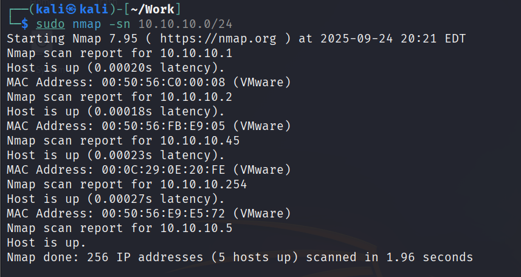
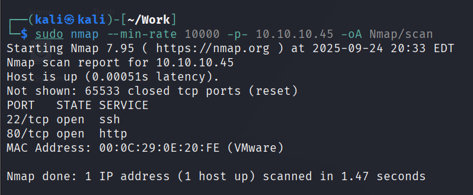
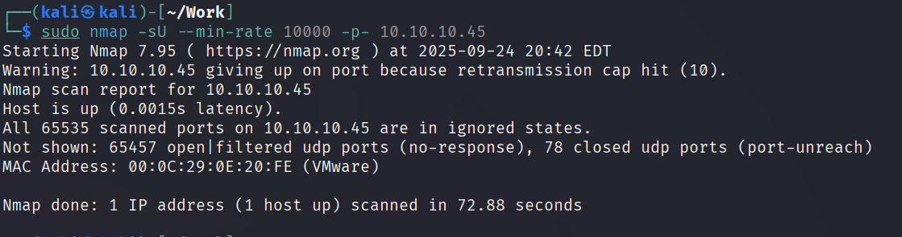
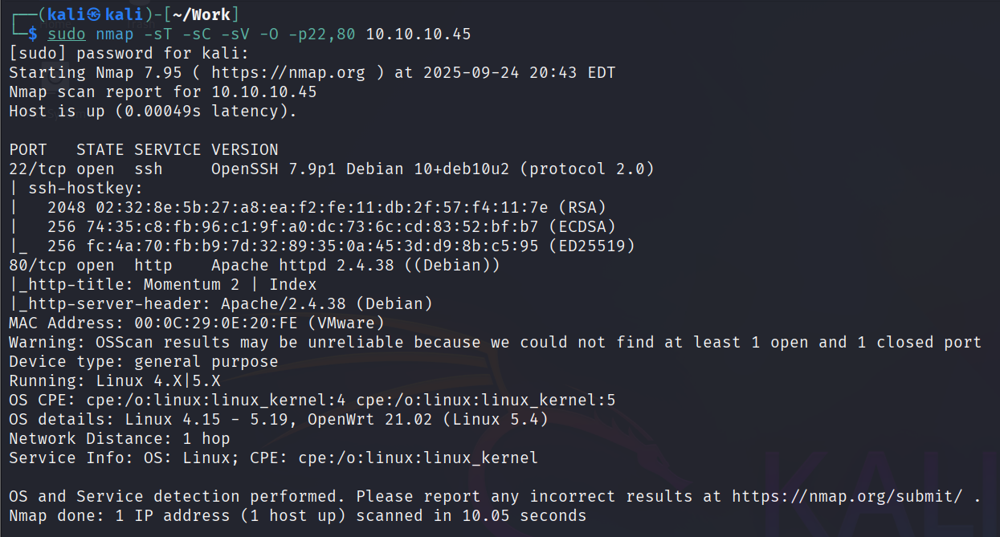
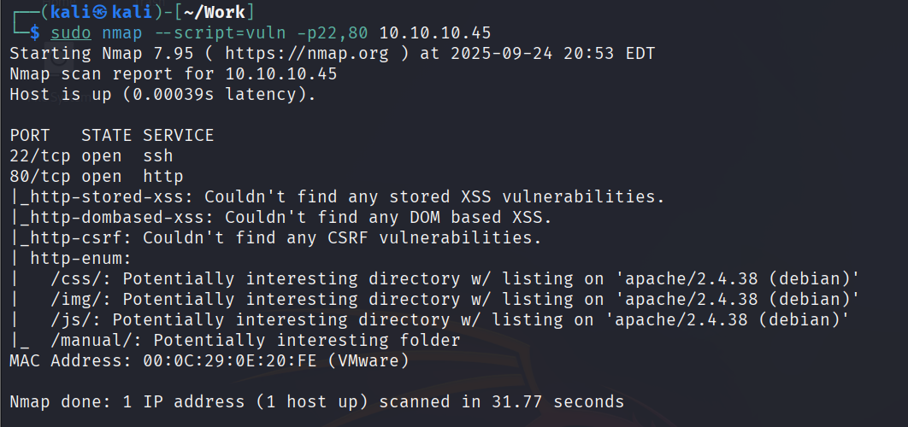
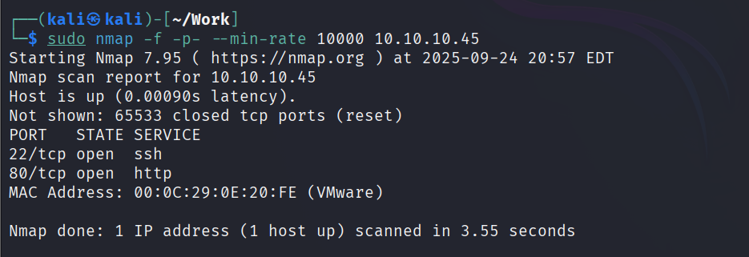

> 以下命令均以 kali本地地址为 10.10.10.5，靶机地址为 10.10.10.45 为案例

## 主机发现

在打本地离线靶机的时候常常需要主机发现，此时可以使用以下命令。

```
sudo nmap -sn 10.10.10.0/24
```

-sn 为 --skip -port-scan 的缩写，意思为不要执行传统的端口扫描，扫描地址为 0/24，该命令为笔者打本地离线机器最常用的主机发现命令，执行结果如下。



其中 10.10.10.1 与 10.10.10.2 、10.10.10.254是系统默认地址，10.10.10.5 是 kali 地址，所以 10.10.10.45 就是靶机的地址。 

## TCP 端口扫描

在主机发现后一般要对存活的机器进行端口扫描，可以使用以下命令。

```
sudo nmap --min-rate 10000 -p- 10.10.10.45 -oA nmap/scan
```

一般可以加上 -sT 指定对 TCP 端口进行扫描，但是实战中有时候指定 -sT 后反而扫描不全，所有去除 -sT；可以使用 -oA 命令将扫描结果全格式保存到 nmap/scan 目录下以便于随时回顾，命令执行结果如下。



可以发现靶机开放了 22 ssh 端口和 80 http 端口。

## UDP 端口扫描

在执行完 TCP 扫描后应该进行 UDP 扫描以免有漏掉的 UDP 端口，可以使用以下命令。

```
sudo nmap -sU --min-rate 10000 -p- 10.10.10.45 -oA nmap/udp-scan
```

命令结构与 TCP 扫描类似，多了个 -sU 指定对 UDP 端口进行扫描，执行结果如下。



可以看到 UDP 没有扫描到开放的端口。
## TCP 详细情况扫描

在扫描完成后要对 TCP 端口的详细情况进行扫描，可以使用以下命令。

```
sudo nmap -sT -sC -sV -O -p22,80 10.10.10.45 
```

-sT 指定对 TCP 端口，-sC 使用默认脚本扫描，-sV 进行服务和版本的探测，-O 进行操作系统的探测，指定端口为 22,80，执行结果如下。



可以看到 nmap 列出了端口详细情况。

## 默认脚本扫描

在执行完端口详细扫描后一般还会执行 nmap 的 默认脚本扫描，可以执行以下命令。

```
sudo nmap --script=vuln -p22,80 10.10.10.45
```

--script=vuln 指定以 nmap 的默认脚本进行扫描，指定端口为 22、80，执行结果如下。



可以看到 nmap 已经对端口进行了默认脚本扫描，并输出了结果。

## 数据包分片扫描

有时候因为防火墙等原因，需要进行数据包分片扫描发现端口，可以使用以下命令。

```
sudo nmap -f -p- --min-rate 10000 10.10.10.45
```

-f 使用 IP 分片技术，一块一块发送数据包，减小被防火墙拦截的概率，执行结果如下。



可以看到靶机开放了 22、80 端口。

## 源端口、随机端口顺序、慢速扫描

以下是笔者在打靶过程中还用过的绕过防火墙扫描命令。

### 源端口扫描

```
sudo nmap --source-port 53 -p- --min-rate 10000 10.10.10.45
```

### 随机端口扫描

```
sudo nmap -r -p- --min-rate 10000 10.10.10.45
```

### 慢速扫描

```
sudo nmap -T2 -p- 10.10.10.45
```