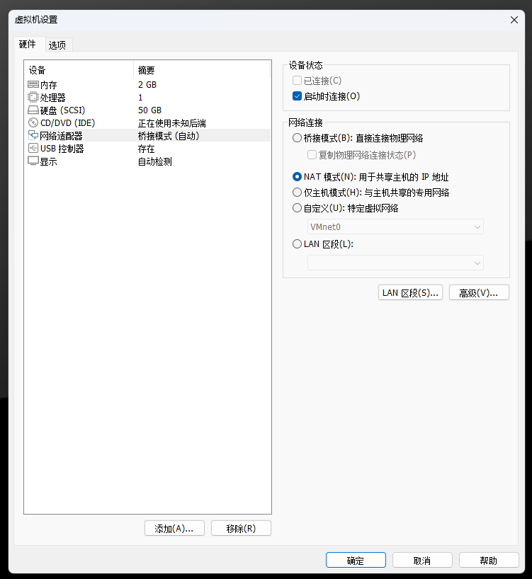
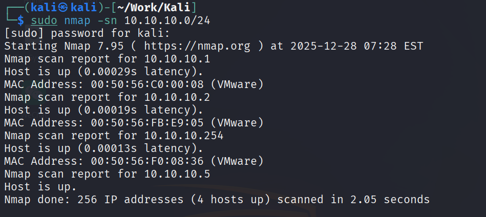
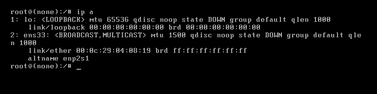
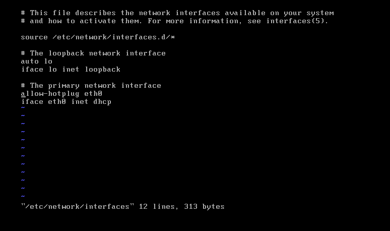
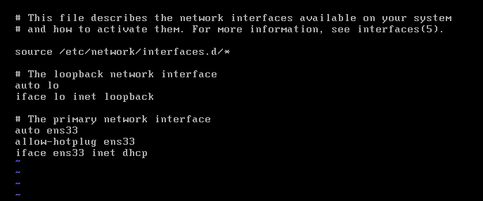
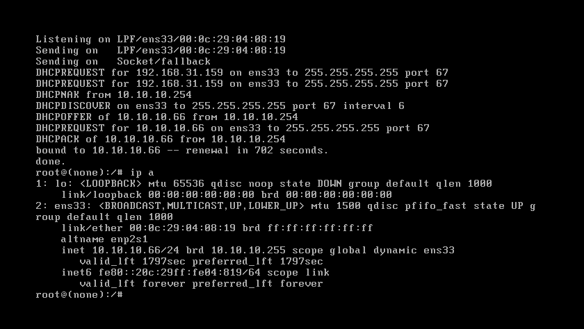
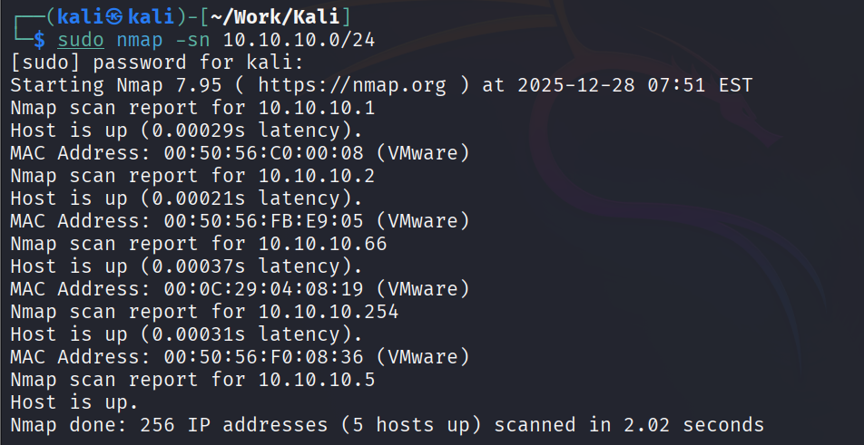

> 此文章以 kali 地址为 10.10.10.5 为示例

## 环境判断

确保靶机为 NAT 连接



在 kali 中执行 nmap 扫描，未发现靶机的地址



## 获取 DHCP

> [如何进入单用户模式](https://www.volcengine.com/docs/6396/81140)

以 Debian 为例，进入单用户模式后查看网卡信息，为 ens33



为 interface 文件添加 ens33





保存后执行网络重启命令后获得 ip

```bash
service networking restart
```



回到 kali 中，重新获得 ip

