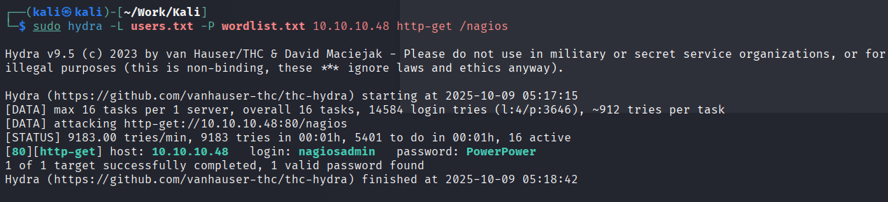

在遇到目标网站且使用 *kali* 默认的 *rockyou* 字典爆破时间过长时可以尝试通过 *cewl* 与 *john* 结合生成目标定制的字典缩短爆破时间。

## 可能使用到的 Cewl 及 john 命令及解释

### Cewl 语句及其解释

```bash
sudo cewl http://10.10.10.48 -w password.txt 
```

这个命令直接指定 *url* 生成一个包含所有提取单词的字典文件，并保存为 *password.txt* 文件。

```bash
sudo cewl -m 6 http://10.10.10.48 -w password.txt 
```

这个命令使用 *-m 6* 设置提取的单词长度最小为 *6* 。

```bash
sudo cewl -d 2 http://10.10.10.48 -w password.txt 
```

这个命令使用 -d 2 使 *Cewl* 递归爬取网站内部链接，深度为 *2* 。

```bash
sudo cewl -c http://10.10.10.48 -w password.txt 
```

这个命令使用 *-c* 去除重复单词，并显示单词出现的次数。

```bash
sudo cewl -e http://10.10.10.48 -w password.txt 
```

这个命令使用 -*e* 保留所有发现的电子邮件地址。

### john 语法及其解释

```bash
sudo john --rules -wordlist=password.txt --stdout | sort | uniq > wordlist.txt
```

使用 *--rules* 指定内置密码规则生成新密码组合，*--wordlist=password.txt* 指定原始字典为 *passowrd.txt* ，使用 *--stdout* 将生成的密码标准输出，*sort* 对单词进行排序，*uniq* 去重。

## 使用 hydra 指定生成的字典进行爆破

```bash
sudo hydra -L users.txt -P wordlist.txt 10.10.10.48 http-get /nagios
```

