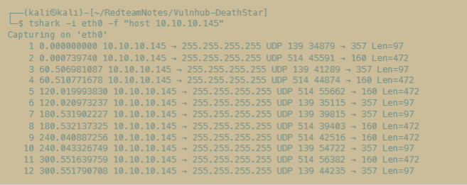

# 架构基础

## Libpcap（Packet Pactrue Library）

Libpcap 是 Unix/Linux 下的标准数据包捕获库，tshark、tcpdump、wireshark 都是通过获取这个接口实现抓包功能。

## BPF

执行流程：
1. 用户在命令行输入高级过滤语句。
2. libpcap 编码器转换为 BPF 字节码。
3. BPF 指令加载到内核，在虚拟机中运行。
4. 过滤过的包加载到用户缓冲区。

# 工具对比

## tcpdump

tcpdump 是最轻量、最基础的捕获工具，快速、可靠，可以在 ssh 中使用。

## tshark

tshark 是 wireshark 的完整命令行模式，调用 dumpcap 进行实际捕获。

## wireshark

wireshark 拥有完整的 ui 界面。

## 用法分析

`-f 'host 10.10.10.45'` 的语法在 tshark、tcpdump、wireshark 等流量分析工具中是通用的，即 BPF 语法。它是一种在内核层面进行的数据包过滤机制，它允许网络抓包工具在数据包传输到用户空间之前就进行筛选，从而大大提高了捕获效率，BPF 提供了一套虚拟指令集，用户可以编写规则，内核在接收到每个数据包时按照这些规则进行判断，只有符合条件的数据包才会被传输到用户空间进行进一步处理，由于在内核中进行过滤能够避免将大量不必要的数据包拷贝到用户空间，这种设计不仅优化了性能，还降低了系统资源的消耗，使得 BPF 成为了许多网络分析、监控和安全审计工具的核心组件。



例如上面这个执行结果，10.10.10.145 这台主机以 UDP 协议向广播地址 255.255.255.255 发送数据包，流量呈现出明显的周期性和两种不同特征，数据包大概每隔 60 秒成对出现，一类数据包显示 UDP，字段为 139，负载较小，一类数据包显示 UDP，字段为 514，负载较大。周期内数据包发送顺序可能互换，表明了主机很可能在进行某种广播式的服务或心跳检测，利用 UDP 的无连接特性通过广播方式向网络中其他设备通告状态信息或探测服务。整个流量特征体现了主动广播、定时发送以及数据包大小与内容明显区分的规律性，这在网络设备中并不罕见，有必要进一步看具体的数据意义。

```
tsahrk -i eth0 -f 'host 10.10.10.45' -w Enilmalus.pcap

tsahrk -r Enilmalus.pcap -V

tshark -r Enilmalus.pcap -T fields -e data | tr -d ' ' | xxd -r -p
```

解释一下最底下这个命令，这是一个完整的网络数据分析流程，从抓包文件 Enilmalus.pcap 中提取原始数据并将其转换为人类可读的文件。命令从 tshark 开始，它是 wireshark 的命令行版本，用于处理网络流量，前面捕捉流量，现在读取，-r 时 read 的缩写，指示 tshark 从 Enilmalus.pcap 中读取数据：-T 是 type 的缩写，指定输出类型为 fields（字段），表示以字段形式输出而不是完整的数据包详情；-e 是 extract 的缩写，后面接 data，告诉 tshark 提取每个数据包的原始负载，通常以十六进制字符串形式输出，例如 `48 65 6c 6c 6f`。接着，管道符号 `|` 将输出传递给 tr ，这是一个 translate 的工具；-d 是 delete 的缩写，后面跟 `' '` ，表示一处所有空格，表示移除所有空格，把带空格的 `48 65 6c 6c 6f` 变成 `48656c6c6f`。最后，另一个管道  `|` 将结果交给 xxd。一个处理十六进制字符串的工具，其名称为 `hexadecimal` 和 `dump` 的组合，用于创建或解析数据的十六进制转储；-r 是 reverse 的缩写，表示将十六进制字符串转换为二进制；-p 是 plaintext 的缩写，处理没有分隔符的连续十六进制字符串，最终 `48656c6c6f` 解读为可读的 `Hello`。