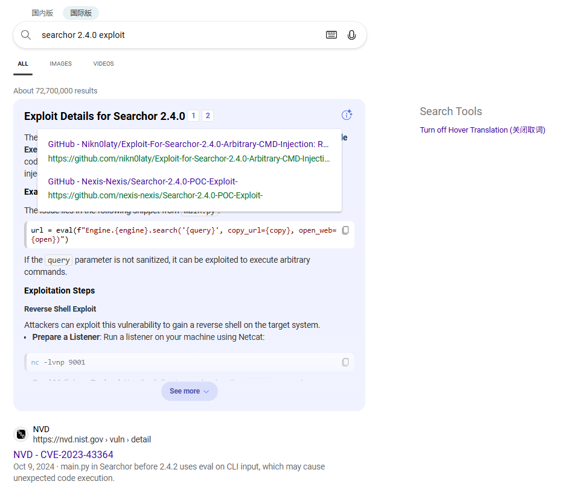
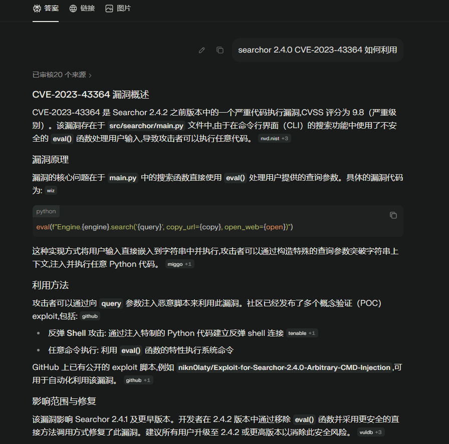

> 本文章以笔者写过的 80 台靶机为样本做渗透测试方法论分析

# 靶机分类

## 攻击链复杂度分层

### Easy 类型

这类靶机没有复杂的攻击链，一般进行 信息收集、单漏洞利用 就可以拿到一个初始的立足点，然后进行简单的提权操作即可获得 root 权限。

#### Web 漏洞链路

```
信息收集 → 目录爆破 → Web漏洞（SQL注入/命令注入/文件上传 等）→ 获得初始立足点 → 本地提权（SUID/Sudo/Cron/内核漏洞 等）
```

例如：
- Hack The Box 靶机 Busqueda 访问 80 端口暴露出使用的为开源系统 Searchor 2.4.0，随后在网络上搜索相关的漏洞利用





在 kali 本地监听获得初始立足点后进行手工枚举（sudo -l ; whoami ;ip a 等），随后根据具体的情况进行进一步提权

#### 凭证泄露

```
服务枚举（SMB/FTP/NFS）→ 匿名访问/弱密码 → 凭证发现 → SSH/WinRM登录 → 提权
```

例如：
- VulnHub 的靶机 LazySysAdmin 开启了 smb 服务，通过连接共享文件夹获取 mysql  和 phpmyadmin 的账号密码，通过暴力破解密码，ssh 获得初始立足点，随后提权。

#### 已知 CVE 利用

```
版本识别 → CVE查询 → POC利用 → 过的初始立足点 → 基础
```

例如：
- Hack The Box 的靶机  Broker，通过利用 ActiveMQ 的 CVE payload 获得初始立足点

### Medium 类型

这类靶机相对 Easy 类型靶机攻击难度略微复杂 